# Preamble

This is documentation for my CPU design and a journal of my learning experience. I will write this document in a manner to detail everything I'm doing so the more experienced can better guide me to improve my design and the "not-so-experienced" like myself can have an easy, accessible manual on how to design a CPU to prove that it's not as daunting as they may believe. Yeah, it's easy to say this when you already know what you're doing, but I think it would be interesting to see a project like this develop as you're reading this.<br>

The goal here is to initially create a basic RISC-V processor. Over time, I will implement more advanced features and extensions. To try to make the document as concise as possible, I will frequently reference the primary resources in the [Prerequisite Material section](#prerequisite-material).<br>

[Jump to Table of Contents](#table-of-contents)

# Table of Contents

- [Preamble](#preamble)
- [Prerequisite Material](#prerequisite-material)
- [Part I: Learning the RISC-V ISA](#part-i-learning-the-risc-v-isa)
- [Part II: Choosing a Logic Simulator Tool](#part-ii-choosing-a-logic-simulator-tool)
- [Part III: Implementing RV32I (Single Cycle Architecture)](#part-iii-implementing-rv32i-single-cycle-architecture)
	- [Memory Units](#memory-units)
	- [ALU](#alu)
		- [ADD](#add)
		- [SUB](#sub)
		- [Shift Left Logical](#shift-left-logical)
		- [Set if Less Than (Signed)](#set-if-less-than-signed)
		- [Set if Less Than (Unsigned)](#set-if-less-than-unsigned)
		- [XOR](#xor)
		- [Shift Right Logical](#shift-right-logical)
		- [Shift Right Arithmetic](#shift-right-arithmetic)
		- [OR](#or)
		- [AND](#and)
	- [CPU Datapath](#cpu-datapath)
		- [Fetching Instructions](#fetching-instructions)
		- [ADDI](#addi)
		- [ADD](#add-1)
		- [SUB](#sub-1)
		- [SLL](#sll)
		- [SLT](#slt)
		- [SLTU](#sltu)
		- [XOR](#xor-1)
		- [SRL](#srl)
		- [SRA](#sra)
		- [OR](#or-1)
		- [AND](#and-1)
		- [SLLI](#slli)
		- [SLTI](#slti)
		- [SLTIU](#sltiu)
		- [XORI](#xori)
		- [SRLI](#srli)
		- [SRAI](#srai)
		- [ORI](#ori)
		- [ANDI](#andi)
		- [SB/LB/LBU](#sblblbu)
		- [SH/LH/LHU](#shlhlhu)
		- [SW/LW](#swlw)
		- [BEQ](#beq)
		- [BNE](#bne)
		- [BLT](#blt)
		- [BGE](#bge)
		- [BLTU](#bltu)
		- [BGEU](#bgeu)
		- [LUI](#lui)
		- [AUIPC](#auipc)
		- [JAL](#jal)
		- [JALR](#jalr)
- [Part IV: Implementing RV32I (Pipelined Architecture)](#part-iv-implementing-rv32i-pipelined-architecture)
- [Special Thanks](#special-thanks)

# Prerequisite Material

Prepping for this, I used these online resource I found:

- Primary
	- [Computer Organization and Design: The Hardware or Software Interface (RISC-V Edition)](./Resources/Computer_Organization_and_Design-The_Hardware_or_Software_Interface_RISC-V_Edition.pdf)
	- [Digital Design and Computer Architecture (RISC-V Edition)](./Resources/Digital_Design_and_Computer_Architecture_RISC-V_Edition.pdf)
	- [Unprivileged RISC-V Instruction Set Manual (Volume 1)](./Resources/RISC-V_Unprivileged_Specification_Manual.pdf)
- Supplementary
	- [All About Circuits](https://www.allaboutcircuits.com/textbook/digital/)
	- [GeeksforGeeks](https://www.geeksforgeeks.org/digital-electronics-logic-design-tutorials/)
	- [Neso Academy - Digital Electronics YouTube Playlist](https://www.youtube.com/playlist?list=PLBlnK6fEyqRjMH3mWf6kwqiTbT798eAOm)

**Note: For the sake of conciseness, I will name the "Computer Organization and Design: The Hardware or Software Interface (RISC-V Edition)" book by John L. Hennessy and David A. Patterson as the "Comp Org book", the "Digital Design and Computer Architecture (RISC-V Edition)" book by Harris & Harris as the "Digital Design book", and the "Unprivileged RISC-V ISA Manual" as the "RISC-V spec".**

[Jump to Table of Contents](#table-of-contents)

# Part I: Learning the RISC-V ISA

The official *RISC-V spec (page 554)* and the *Comp Org book (page 504)* are what I used to learn the instruction formatting.

[Jump to Table of Contents](#table-of-contents)

# Part II: Choosing a Logic Simulator Tool

Now, that I have studied the base ISA a little bit, now it's time for me to start learning by doing. This project will undergo different revisions so I will try my best to journal everything I do while keeping everything as concise as possible for those of you reading this.<br>

For my tool, I will choose [Logisim Evolution](https://github.com/logisim-evolution/logisim-evolution) as my simulator tool. Logisim Evolution is a free and open-source digital circuit simulator tool that is a continuation of the Logisim tool from Dr. Carl Burch.

You can install Logisim Evolution directly from the GitHub link above in the Releases tab. After installing, opening the application will look like this:

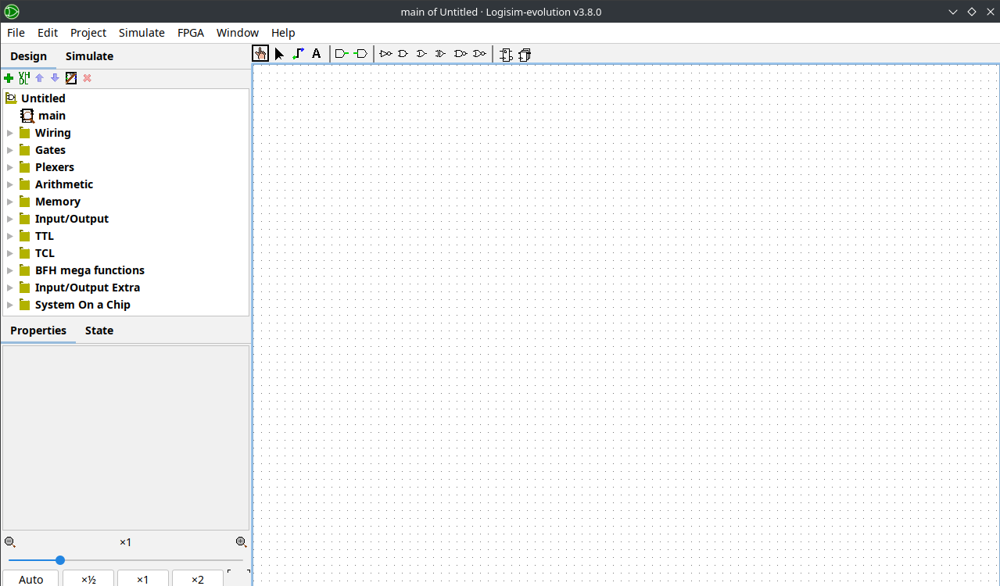

[Jump to Table of Contents](#table-of-contents)

# Part III: Implementing RV32I (Single Cycle Architecture)

First, I will implement a single-cycle RISC-V processor. It is the simplest architecture to implement and I will use this as a stepping stone to implement more complex, realistic designs.<br>

## Memory Units

Using Chapter 7 from the Digital Design book to guide my datapath, I will start by adding the memory units of the CPU. Since I'm doing a single-cycle design, I will need to separate the program and data memories, making this a classic [Harvard-style architecture](https://www.geeksforgeeks.org/harvard-architecture/#).<br>

The memory units I will add are:
- Data Memory
- Program Memory
- Register File
	- General Purpose Registers: `x0 - x31`
	- Program Counter: `pc`

<ins>Data Memory</ins>

To build, the data memory, I will need to address to multiple RAM blocks that are byte-addressable. Each RAM block must be able to store or load up to 4 bytes. I must be able to select between storing or loading data. Whether I'm storing or loading data, I need to flag to this RAM block to treat the data as a 8-bit byte, 16-bit halfword, or 32-bit full word.<br>

For the RAM block, there are 9 inputs and 1 output.

- Inputs
	- Unsigned0_Signed1: This will be an input to the bit extenders. In these, I can choose to either zero extend or "one" extend the output. If I choose the "sign mode" on the bit extenders, it will sign extend if I choose load a byte unsigned. If I choose the "input mode" on the bit extenders, it will blindly one or zero extend depending on the input. If I want it to correctly load a byte/half word signed or unsigned with the correct extension, I need to AND the unsigned/signed input flag with the **most significant bit** of the respective data output. That's why I included AND gates at the bit extenders.
		- 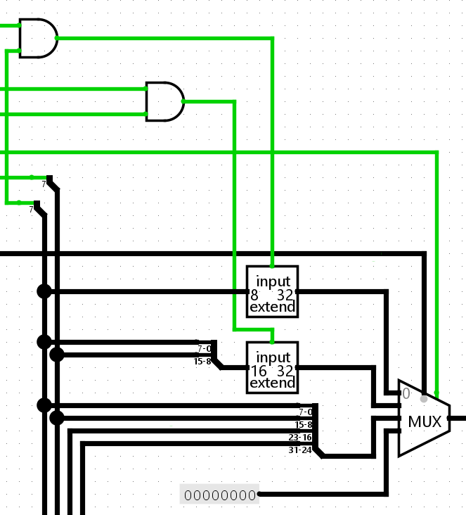
	- Reset: This will asynchronously clear the contents of the RAM to a known state. No instruction will have access to this pin, but this will be here in case if I need it for any init state.
	- Enable: This will enable either the loading or storing modes of the RAM block. This is for when I place this RAM block in outer circuit blocks. I will use the lower 24 bits of the address as the address inputs of the RAM blocks and use the upper 8 bits to decode the enables for those blocks.
	- Load: This will flag the RAM modules in the RAM block to output data.
	- Store: This will flag the RAM modules in the RAM block to save data from the "Data_In" input.
	- Size_Flag: This is a 2 bit input that will signal the RAM block if I want to store or load a byte (8 bits), a half word (16 bits), or a full word (32 bits). If an invalid size flag is detected, the RAM block shouldn't do anything.
		- 00 = Store/Load Byte
		- 01 = Store/Load Half Word
		- 10 = Store/Load Word
		- 11 = Invalid
	- Address: This is a 24-bit input that will address the individual bytes in the RAM modules.
	- Clock: This is the clock signal to synchronously control the RAM modules.
	- Data_In: This is a 32 bit input that will be stored if the store input is enabled. The "Size_Flag" input will determine if a byte, a half word, or a full word will be stored.
- Outputs
 	- Data_Out: This is a 32 bit output that represents the data that is being loaded if the Load input is enabled. The "Size_Flag" input will determine if a byte, a half word, or a full word will be loaded.

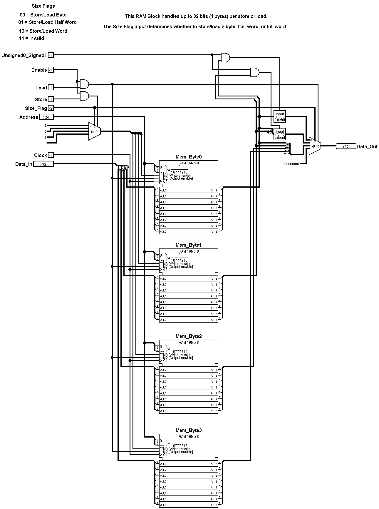

Now that the RAM block is implemented, I will decode 16 of these blocks to total my data memory to 256MB (16 * 16 MB = 256 MB).<br>

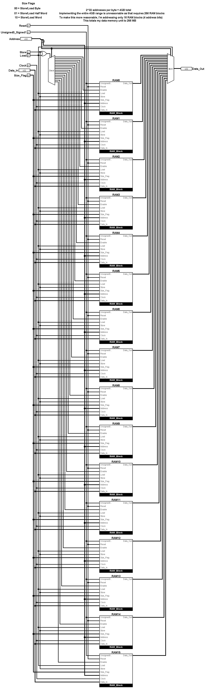

<ins>Program Memory</ins>

For the program memory, I will simply add one Read-Only Memory (ROM) module that is 256 with an address with of 8 bits. The maximum is 24 bits (16 MB) but that will just make program files needlessly large. 8 bits is just fine for the purposes of this project.

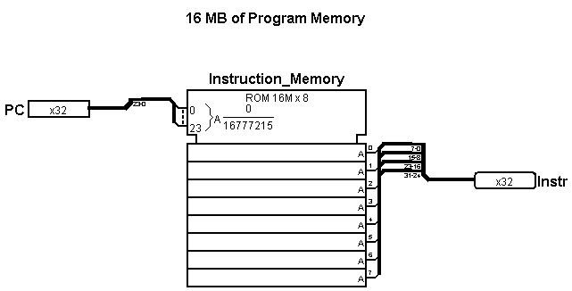

<ins>Register File</ins>

According to the RISC-V spec, there are 32 general-purpose registers including a program counter register. In this module, I have 8 inputs and 3 outputs.

- Inputs
	- Read_Register1: This is a 5 bit input that will be our "rs1" from the R,I,S, and B-type instruction formats. It connects to the select bits of a multiplexer that selects which register data that will output as the first register operand.
	- Read_Register2: This is a 5 bit input that will be our "rs2" from the R,S, and B-type instruction formats. It connects to the select bits of a multiplexer that selects which register data that will output as the second register operand.
	- Write_Data: This is a 32 bit input that will be the data to write, assuming the Write_Enable bit is asserted. 
	- Clock: This is our clock signal.
	- Reset: The registers are reset asynchronously. If this input asserts then all of the registers will reset. This is mainly to hard-initialize the registers to a known state.
	- Write_Register: This is a 5 bit input that is connected to the select bits of a 5-to-32 decoder. The decoder controls the write enable bits of each register, with exception to x0 since that will always be hardcoded to a value of 0.
	- Write_Enable: This is the enable input for the decoder to select a register to write to. If enabled, the decoder will select based on the Write_Register value. Otherwise, no register is selected.
	- PC_In: This is the program counter value to update the pc register to. The pc register always has its write enable bit to 1 since the program counter register will always be written at every clock cycle.
- Outputs 
	- Reg1_Out: This is a 32 bit output that is the register data of the first register operand.
	- Reg2_Out: This is a 32 bit output that is the register data of the second register operand.
	- PC_Out: This is a 32 bit output that represents the current program counter value.

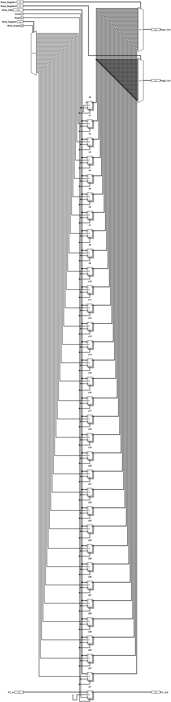

[Jump to Table of Contents](#table-of-contents)

## ALU

Up next is the ALU, which is our arithmetic and logical engine. I will use the ALU that has a 3-bit opcode to implement the following functions:
- 000 = ADD/SUB
- 001 = SLL (Shift Left Logical)
- 010 = SLT (Set if Less Than)
- 011 = SLTU (Set if Less Than (Unsigned))
- 100 = XOR
- 101 = SRL/SRA (Shift Right Logical / Shift Right Arithmetic)
- 110 = OR
- 111 = AND
<br>

I will use the `funct3` bit fields of the instruction to give to the ALU as the "Opcode", which will determine which function to mux out.<br>

**Note: Since the Digital Design book is only implementing a small subset of the ISA, I will be deviating a little bit from the book.**

[Jump to Table of Contents](#table-of-contents)

### ADD

For the first submodule of the ALU, I will create a 32-bit adder. I could just use Logisim's built-in adder module, but I want to manually implement a more advanced version of an adder circuit such as a [Carry Lookahead adder](https://www.geeksforgeeks.org/carry-look-ahead-adder/#) just for fun.

<ins>Half Adder</ins>

My half adder is a standard half adder unit with S = A XOR B and C = A AND B.

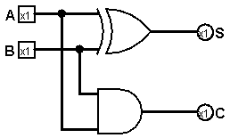

<ins>Full Adder</ins>

For a classic full adder, it combines 2 half adders along with an OR gate for the carry out.

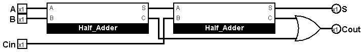

<ins>4-Bit Carry Generator</ins>

For our CLA, I will preemptively generate 4 carry bits with one singular carry in. I could try to generate all 32 carry bits, but that is not reasonable. 4 carry bits is large enough at that. One of the biggest pitfalls of the CLA is while it is fast, it gets complex and way too time-consuming to create for a large number of bits. The only reason I even managed to create a CLA4 block was at least Logisim allowed me to copy and paste the same sub-circuit.<br>

For me to create a 32 bit adder with this sub-block, I will need to cascade the CLA4 block 8 times. Yes, that means carry bits will still ripple through these CLA blocks, but having 8 carry bits ripple is a lot better than 32 for a classical Ripple Carry Adder. In a logic simulator that doesn't take propagation delay into account, it doesn't matter, but I still wanted to implement this for my own learning purposes.<br>

Using the formula in the Comp Org book (page 1197 and 1198):

Propagate: `Pi = Ai ⊕ Bi`<br>
Generate: `Gi = Ai ∧ Bi`<br>

Carry: C(i+1) = Gi ∨ (Pi ∧ Ci) = (Ai ∧ Bi) ∨ ((Ai ⊕ Bi) ∧ Ci)

- C0 = Cin<br>
- C1 = G0 ∨ (P0 ∧ C0) = `(A0 ∧ B0) ∨ ((A0 ⊕ B0) ∧ Cin)`<br>
- C2 = G1 ∨ (P1 ∧ C1) = (A1 ∧ B1) ∨ ((A1 ⊕ B1) ∧ (`(A0 ∧ B0) ∨ ((A0 ⊕ B0) ∧ Cin)`))<br>
- C3 = G2 ∨ (P2 ∧ C2) = (A2 ∧ B2) ∨ ((A2 ⊕ B2) ∧ (A1 ∧ B1) ∨ ((A1 ⊕ B1) ∧ (`(A0 ∧ B0) ∨ ((A0 ⊕ B0) ∧ Cin)`)))<br>
- C4 = G3 ∨ (P3 ∧ C3) = (A3 ∧ B3) ∨ ((A3 ⊕ B3) ∧ ((A2 ∧ B2) ∨ ((A2 ⊕ B2) ∧ (A1 ∧ B1) ∨ ((A1 ⊕ B1) ∧ (`(A0 ∧ B0) ∨ ((A0 ⊕ B0) ∧ Cin)`)))))<br>

**As you can see, as the bits increase, the complexity increases dramatically, which is probably why when you Google "32-bit Carry Lookahead adder", the most you'll find is design with cascaded carry lookadhead sub blocks.**

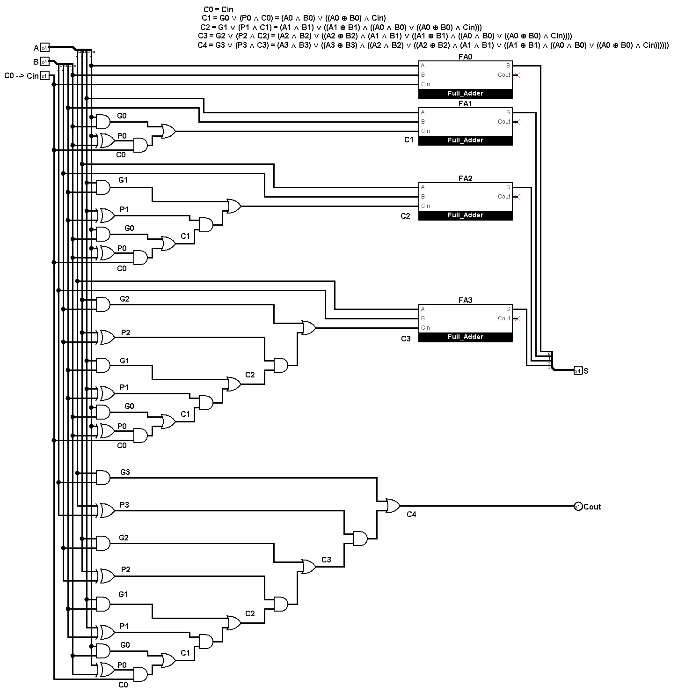

<ins>32-Bit Carry Lookahead Adder</ins>

Now, all I have to do is cascade 8 CLA4 blocks for a 32-bit adder module.

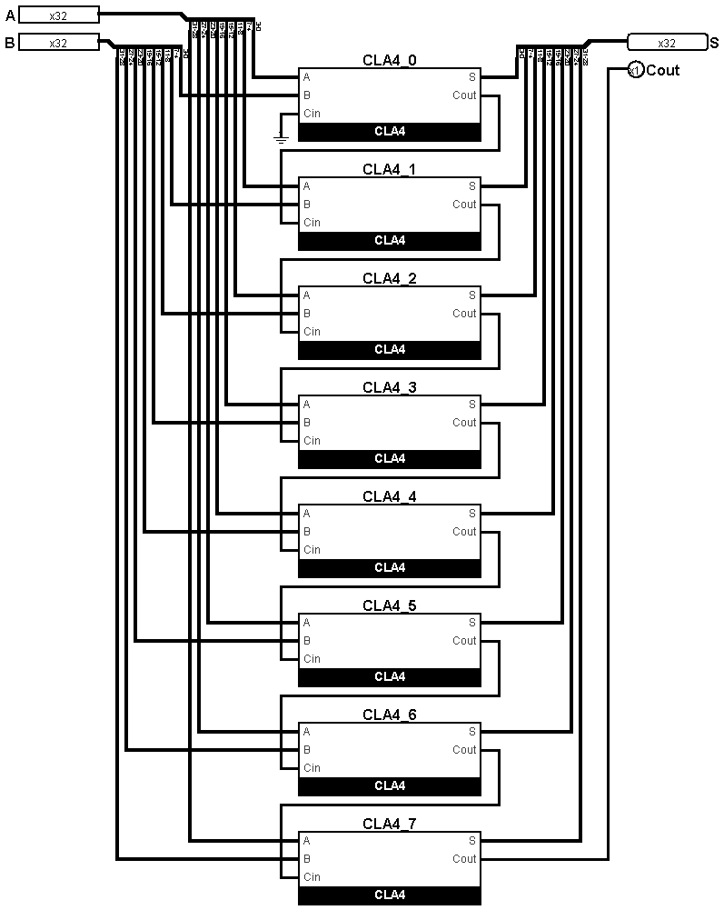

[Jump to Table of Contents](#table-of-contents)

### SUB

I'm going to add to the adder (yes, that pun was intended) by negating the B input. Remember, A - B is simply A + (-B).  I could just put in the "Subtractor module" but I want to share the same adder module for both functions considering in the RISC-V ISA, the SUB instruction is literally just the ADD instruction with one bit change (funct7[5] = 1). I'll use that bit change to mux out a positive or negative secondary operand while keeping the ADD and SUB instruction using the same funct3 ALU opcode. I've also added in a multiplexer to connect the ALU opcode bit field and an additional mux to select between B and -B for addition or subtraction.


[Jump to Table of Contents](#table-of-contents)

### Shift Left Logical

Up next is the Shift Left Logical (SLL) instruction. This will be a simple addition. I will just add in Logisim's built-in shifter module.

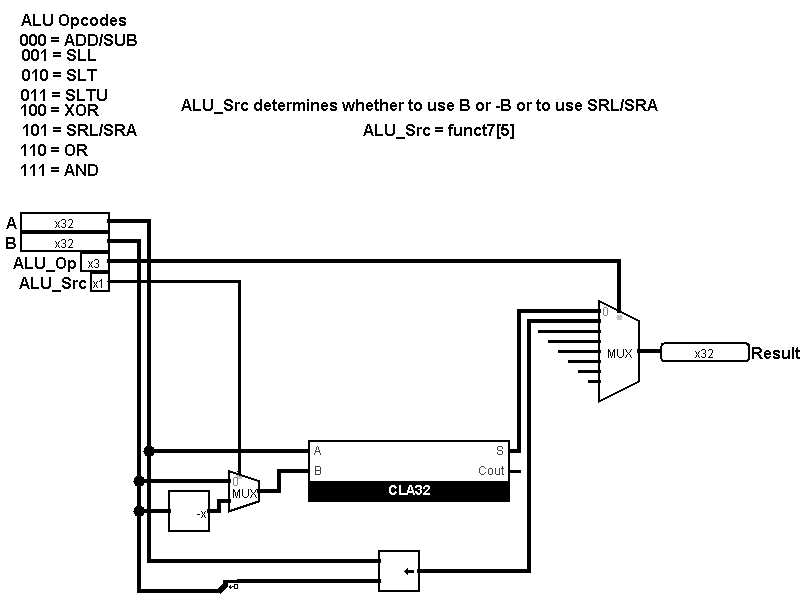

[Jump to Table of Contents](#table-of-contents)

### Set if Less Than (Signed)

For the Set if Less Than (SLT) instruction, I will need to add flags for the ALU.

- N = Result is Negative
	- Result is negative if the most significant bit, Result[31] is 1. The most significant bit determines the sign and if it is 1, that means the value is negative.
	- `N = Result[31]`
- Z = Result is Zero
	- Result is zero if the 32-bit NOR gate is 1. Remember, a NOR gate can only be 1 if both values are zero.
	- `Z = Result[31] ⊽ Result[30] ⊽ ... Result[1] ⊽ Result[0]`
- C = Carry Out
	- We will use the carry out from the CLA32 block for this, but that's not enough. There can only be a carry out on only addition or subtraction operations (when ALU_Op = 000). We can use a 3-input NOR gate for this and then AND that with the carry out.
	- `C = (ALU_Op[2] ⊽ ALU_Op[1] ⊽ ALU_Op[0]) ∧ Cout`
- V = Overflow
	- The result overflowed if these conditions are true:
		1. The A operand and Sum have different signs.
			- `A[31] ⊕ Sum[31]`
		2. Either the A and B operands have the same sign and the ALU is performing addition OR the A and B operands have different signs and the ALU is performing subtraction.
			- `((A[31] ⊙ B[31]) ∧ ¬ALU_Src) ∨ ((A[31] ⊕ B[31]) ∧ ALU_Src)`
	- `V = (A[31] ⊕ Result[31]) ∧ (((A[31] ⊙ B[31]) ∧ ¬ALU_Src) ∨ ((A[31] ⊕ B[31]) ∧ ALU_Src))`

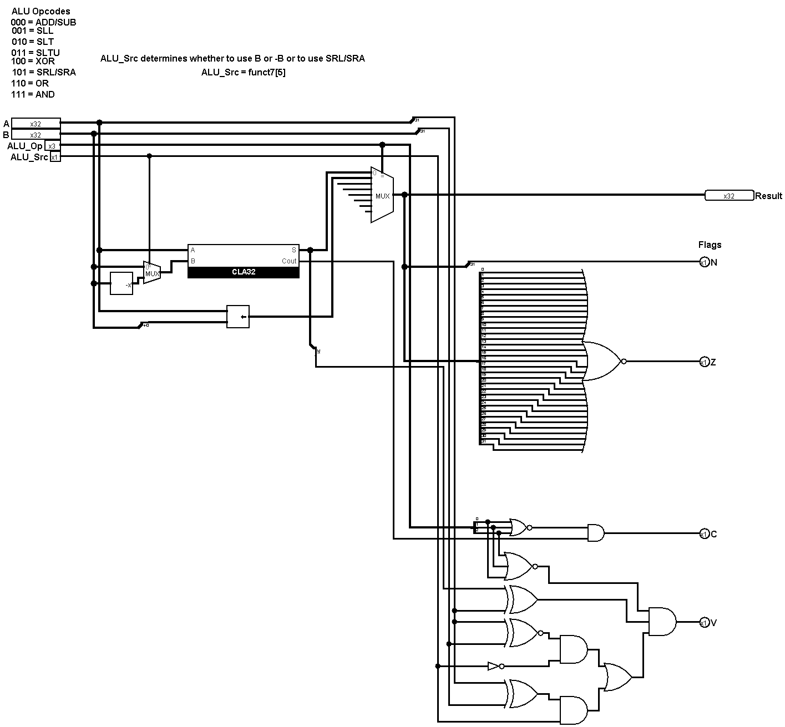

Now that I've added flags to the ALU, I can use these flags for comparisons using *Table 5.2* from the Digital Design book. According to the table, A is less than B as signed values if (A + (-B)) causes `Sum[31] ⊕ V` to be true. 

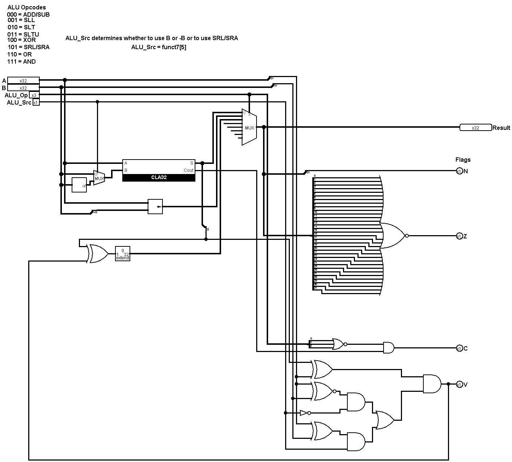

**Note: The reason I omitted one of the conditions for Overflow from the Digital Design book was because I need to take into account that other instructions that need to use the adder such as SLT/SLTU don't share the same opcode as ADD/SUB.**

[Jump to Table of Contents](#table-of-contents)

### Set if Less Than (Unsigned)

I will do the exact same thing from SLT except this time the comparison will be unsigned. To determine if A < B as unsigned, `¬Cout` must be true.

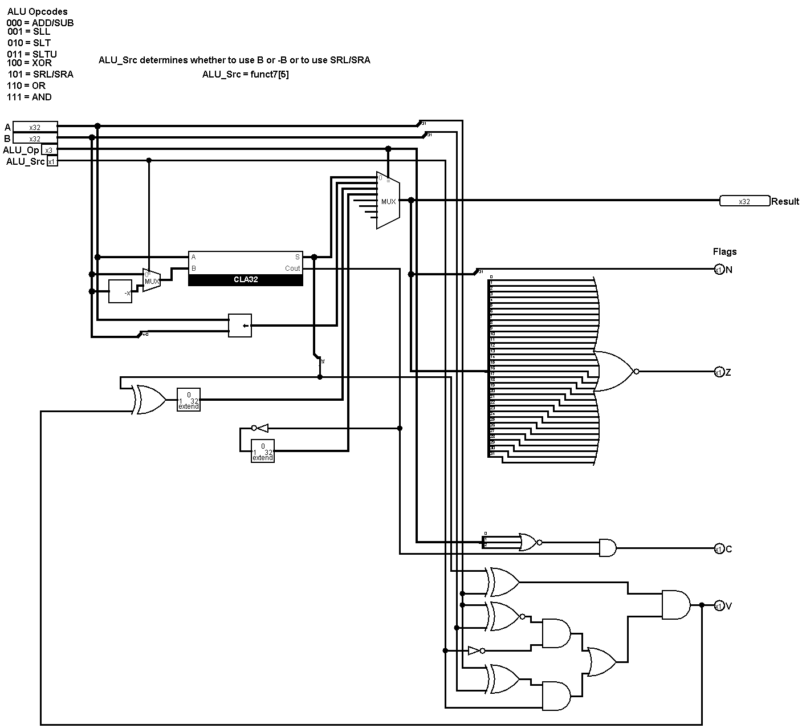

[Jump to Table of Contents](#table-of-contents)

### XOR

This one is pretty easy. I just simply added a 32-bit XOR gate for this one.

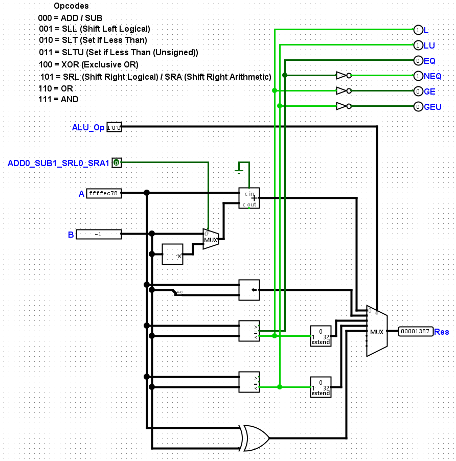

[Jump to Table of Contents](#table-of-contents)

### Shift Right Logical

Similarly to the Shift Left Logical, I will add in the shifter module but instead set it up in Logical Right Shift mode.

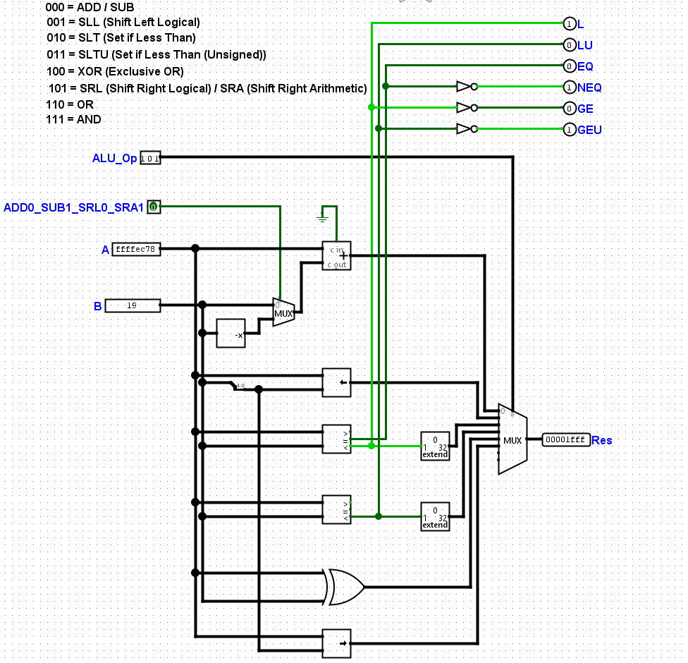

[Jump to Table of Contents](#table-of-contents)

### Shift Right Arithmetic

Since the SRA instruction shares the same opcode with SRL, I will use the special bit to differentiate the two similarly with ADD vs SUB. I will mux out the two logical shift and arithmetic shift with a multiplexer.

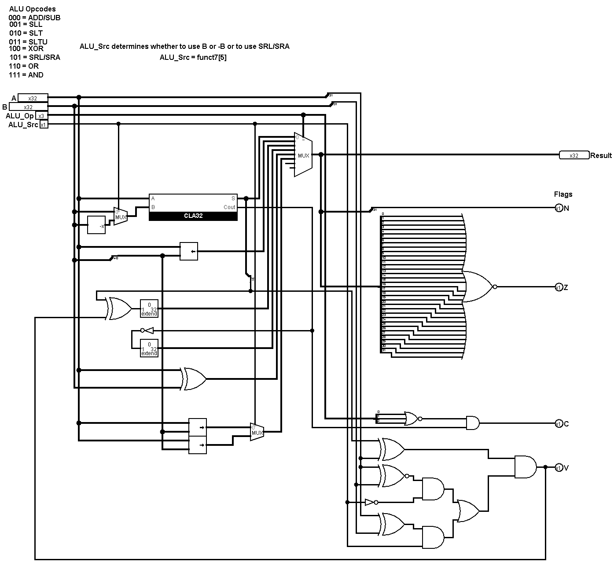

[Jump to Table of Contents](#table-of-contents)

### OR

I just simply added a 32-bit OR gate for this one.


[Jump to Table of Contents](#table-of-contents)

### AND

I just simply added a 32-bit AND gate for this one.

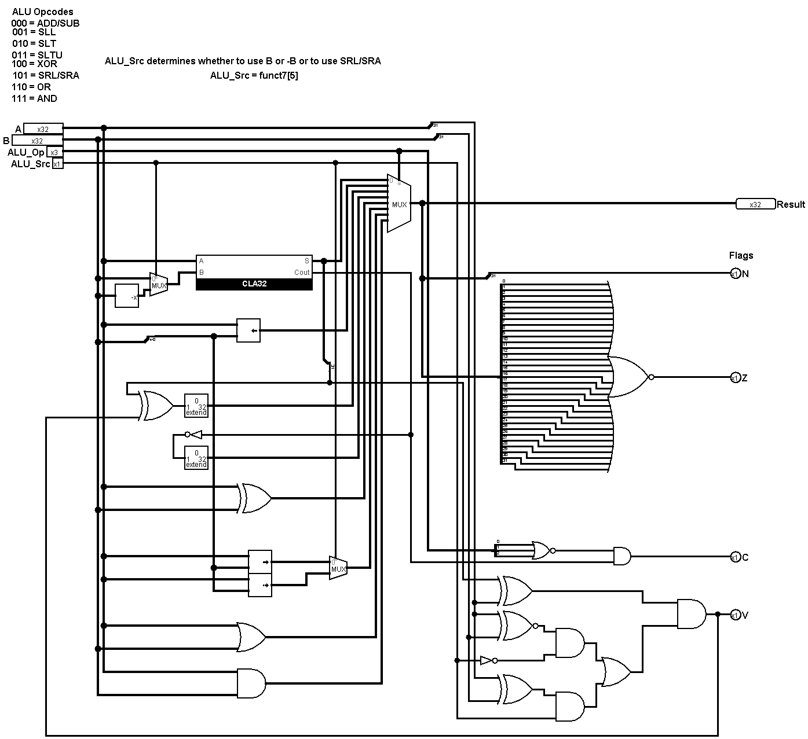

[Jump to Table of Contents](#table-of-contents)

## CPU Datapath

My base ALU is now complete with all of the base RV32I arithmetic/logical operations included. If I wish to add more to it, I will do that later. Now it's time to connect these blocks together to implement each instruction one at a time.

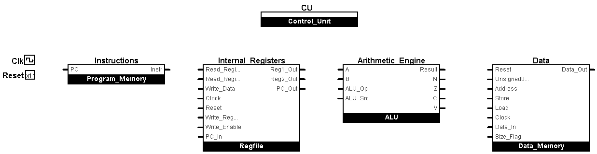

To fully implement this CPU, I need a sample program. I will need to create a program that will will be complex enough to test all of the base instructions:

- R-Type Instructions
	- ADD (Addition)
	- SUB (Subtraction)
	- SLL (Shift Left Logical)
	- SLT (Set if Less Than (Signed))
	- SLTU (Set if Less Than (Unsigned))
	- XOR (Bitwise Exclusive OR)
	- SRL (Shift Right Logical)
	- SRA (Shift Right Arithmetic)
	- OR (Bitwise OR)
	- AND (Bitswise AND)
- I-Type Instructions
	- ADDI (Addition w/ Immediate)
	- SLLI (Shift Left Logical w/ Immediate)
	- SLTI (Set if Less Than Immediate)
	- SLTIU (Set if Less Than Immediate (Unsigned))
	- XORI (Bitwise Exclusive OR w/ Immediate)
	- SRLI (Shift Right Logical w/ Immediate)
	- SRAI (Shift Right Arithmetic w/ Immediate)
	- ORI (Bitwise OR w/ Immediate)
	- ANDI (Bitwise AND w/ Immediate)
	- LB (Load Byte)
	- LH (Load Half-Word)
	- LW (Load Word)
	- LBU (Load Unsigned Byte)
	- LHU (Load Unsigned Half-Word)
	- JALR (Jump and Link Register) <-- Format-wise, this instruction follows more of an I-type than a J-type
- S-Type Instructions
	- SB (Store Byte)
	- SH (Store Half-Word)
	- SW (Store Word)
- B-Type Instructions
	- BEQ (Branch if Equal)
	- BNE (Branch if Not Equal)
	- BLT (Branch if Less Than)
	- BGE (Branch if Greater Than or Equal)
	- BLTU (Branch if Less Than (Unsigned))
	- BGEU (Branch if Greater Than or Equal (Unsigned))
- U-Type Instructions
	- LUI (Load Upper Immediate)
	- AUIPC (Add Upper Immediate to Program Counter)
- J-Type Instructions
	- JAL (Jump and Link)

**Note: Refer to the RISC-V spec document (page 554 and 555) for instruction formatting details. Also, I'm not adhering to the [standard RISC-V assembly conventions](https://github.com/riscv-non-isa/riscv-asm-manual/blob/main/riscv-asm.md). The purpose of this is not to provide a realistic RISC-V assembly program. I will explore that later. The purpose is to have a guide to incrementally implement each instruction, in hardware, one at a time.**

[Jump to Table of Contents](#table-of-contents)

### Fetching Instructions

For the CPU to even execute anything, it needs to be given instructions. Instructions are stored in the Program Memory block and are received from inputting a program counter value into the adddress.<br>

The Program Counter value is stored in the `pc` register in the Register file.

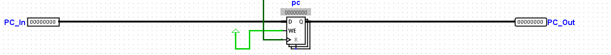

To fetch instructions, connect the PC_Out from the register file to the address input of the program memory. I also went ahead and connected the clock and reset pins to the clock and reset inputs of the data memory and register file blocks.


But to update the program counter and execute the next instruction, I have to add 4 to the program counter and update the program counter value on the next clock cycle.

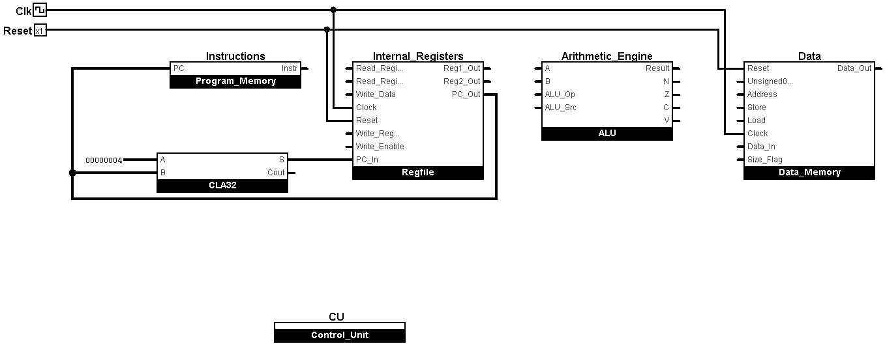

With this current setup, the CPU can now fetch sequential instructions by always adding 4 to the current program counter. However, the rest of the components need to be attached and eventually I will need to implement branching logic. That will come later.<br>

[Jump to Table of Contents](#table-of-contents)

### ADDI

For the first part of my instructions, I need to initialize the registers with some values. I can't do much of anything when all the register values are zeroes. The *ADDI* instruction will be used to insert 12-bit immediate values. <br>

In the Program Memory module, I can directly edit the instructions in a hex editor and save/load a file. Let's test the ADDI instruction with a sample program. Thankfully, there is a [website to encode RISC-V assembly to machine code](https://luplab.gitlab.io/rvcodecjs/) so making these sample programs won't be so tedious.

```
// x1 = 267 (ADDI x1, x0, 267)
//		imm[11:0] = 267 = 000100001011
//		rs1[4:0] = x0 = 00000
//		funct3 = 000
//		rd = x1 = 00001
//		opcode = 0010011
//
//		Instruction = 0001 0000 1011 0000 0000 0000 1001 0011
//					= 0x10B00093
1. 0x10B00093

// x2 = -1227 (ADDI x1, x0, -1227)
2. 0xB3500113

// To test the rest of the registers, set 5 to x3 - x31
3. 0x00500193
4. 0x00500213
5. 0x00500293
6. 0x00500313
7. 0x00500393
8. 0x00500413
9. 0x00500493
10. 0x00500513
11. 0x00500593
12. 0x00500613
13. 0x00500693
14. 0x00500713
15. 0x00500793
16. 0x00500813
17. 0x00500893
18. 0x00500913
19. 0x00500993
20. 0x00500A13
21. 0x00500A93
22. 0x00500B13
23. 0x00500B93
24. 0x00500C13
25. 0x00500C93
26. 0x00500D13
27. 0x00500D93
28. 0x00500E13
29. 0x00500E93
30. 0x00500F13
31. 0x00500F93
```

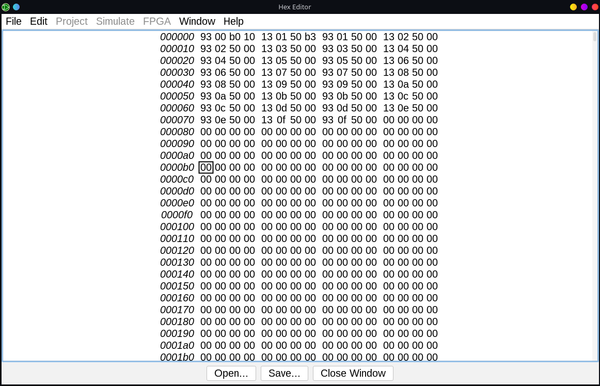

To implement the `ADDI` function, I first need to break apart and decode the instruction. Instruction[6:0] represent the OpCode. I will input that into the CPU control unit.<br>

Instruction[11:7] is the destination register or the "Write_Register" in my register file.<br>

Instruction[14:12] is the funct3 field, which is the ALU_Op input. The obvious thought is to directly connect funct3 to the ALU_Op, but I will actually input it to the Control Unit since I know there will be some other instructions that may or may not have the ALU operation encodings. I will go ahead and connect funct7[5] or Instruction[30] to the Control Unit as well. Since, for now, there is no logic to determine the ALU_Op and ALU_Src inputs yet, I will just connect a plain wire from the funct3/funct7_5 inputs to the ALU_Op/ALU_Src outputs respectively as shown in the screenshot for the Control Unit below.<br>

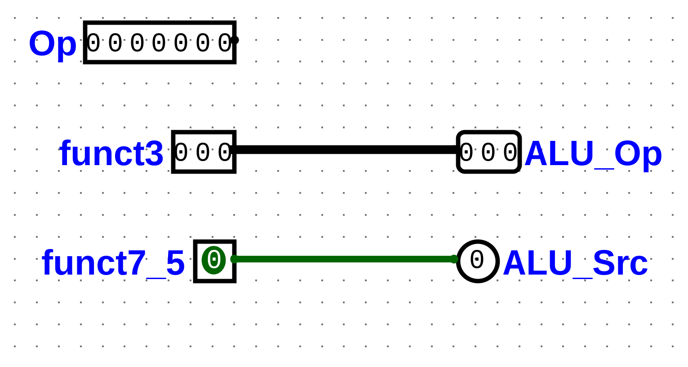

Instruction[19:15] is the first source register or "Read Register 1" in my register file. I will split the instruction bits for the Read_Register1 input and put Reg1_out into the "A" port of the ALU.<br>

Instruction[31:20] is the 12-bit sign-extended immediate value to add to the value of the rs1. All I have to do here is place a bit extender that will be sign-extended and connect that to the "B" port of the ALU.<br>

After that, I must make a connection to the Write_Enable input of the Register File. I'll have the Control Unit handle this. For now, there's no logic since we're assuming all ADDI instructions will write to some destination register. So, the RegWrite output will always be 1.


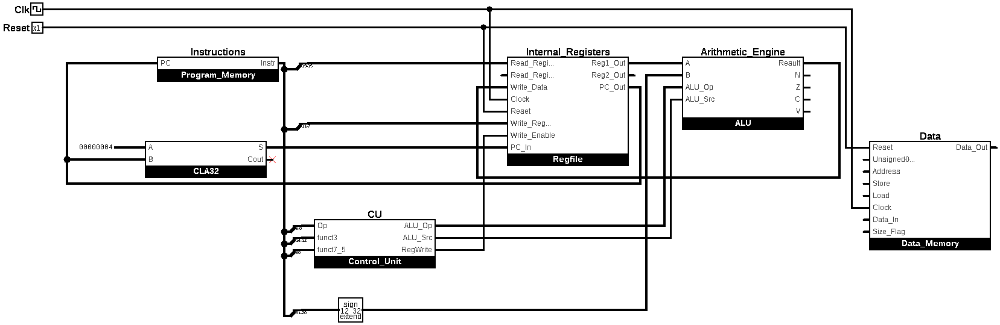

To test this, Logisim has a tab to see all the present values within registers present in the project, which will be very helpful for debugging and testing instructions. Going through the instructions by toggling the clock pin, these are the register values.

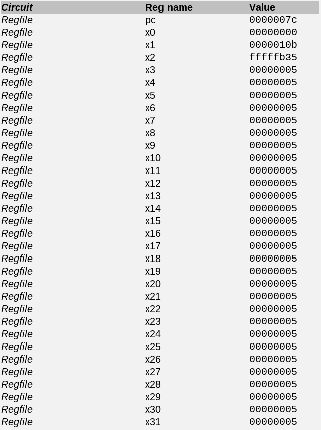

[Jump to Table of Contents](#table-of-contents)

### ADD

Now that I've implemented the ADDI instruction, it's not too much work to modify the datapath to support R-type ADD instructions. Also, forgive me for suddenly going from an I-type instruction to an R-type. I needed to implement ADDI first since I needed a way to initialize registers with values in the program.<br>

Just like I did with `ADDI` instruction, I need to write a simple test program to test the ADD instruction:

```
// x1 = 444 (ADDI x1, x0, 444)
1. 0x1BC00093

// x2 = -448 (ADDI x2, x0, -448)
2. 0xE4000113

// x3 = 3 (ADDI x3, x0, 3)
3. 0x00300193

// x4 = x1 + x2 = 444 - 448 = -4 (ADD x4, x1, x2)
4. 0x00208233

// x5 = x4 + x3 = -4 + 3 = -1 (ADD x5, x4, x3)
5. 0x003202B3
```

After creating the sample program, I need to connect Instruction[24:20] to Read_Register to represent "rs2", the second register address. I also need to select between the sign-extended immediate from the previous ADDI instruction or Reg2_Out. This will be controlled by the Control Unit.<br>

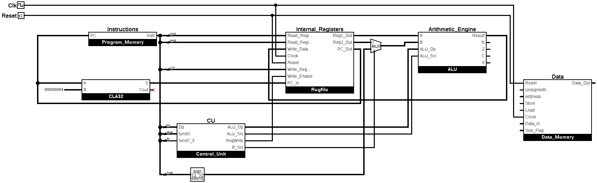

In the Control Unit, now I need some logic to control the outputs because, right now, we're just hard-setting these outputs to certain values with no logic. The ALU_Op output will equal the funct3 input ONLY on these specific opcodes:
- 0010011 (ADDI/SLTI/SLTIU/XORI/ETC)
- 0110011 (ADD/SUB/SLL/SLT/SLTU/ETC)

Otherwise, the ALU_Op will be all zeroes...for now. The ALU_Src will only equal funct7[5] only on R-type instructions (Opcode = 0110011). Also, ALU_Src will equal 1 for all B-type instructions (Opcode = 1100011) since branches are comparisons and comparing use subtraction. This also means I will likely have to add input pins to the Control Unit for the ALU flags.<br>


The RegWrite output will only equal 1 for instructions with a destination register field:
- LUI (Opcode = 0110111)
- AUIPC (Opcode = 0010111)
- JAL (Opcode = 1101111)
- JALR (Opcode = 1100111)
- LB/LH/LW/LBU/LHU (Opcode = 0000011)
- ADD/SUB/SLT/ETC (Opcode = 0110011)
- ADDI/SLTI/XORI/ETC (Opcode = 0010011)

The B_Src will only equal 1 for instructions that use an immediate value instead of a secondary register value.
- LUI (Opcode = 0110111)
- AUIPC (Opcode = 0010111)
- JAL (Opcode = 1101111)
- JALR (Opcode = 1100111)
- LB/LH/LW/LBU/LHU (Opcode = 0000011)
- SB/SH/SW (Opcode = 0100011)
- ADDI/SLTI/XORI/ETC (Opcode = 0010011)

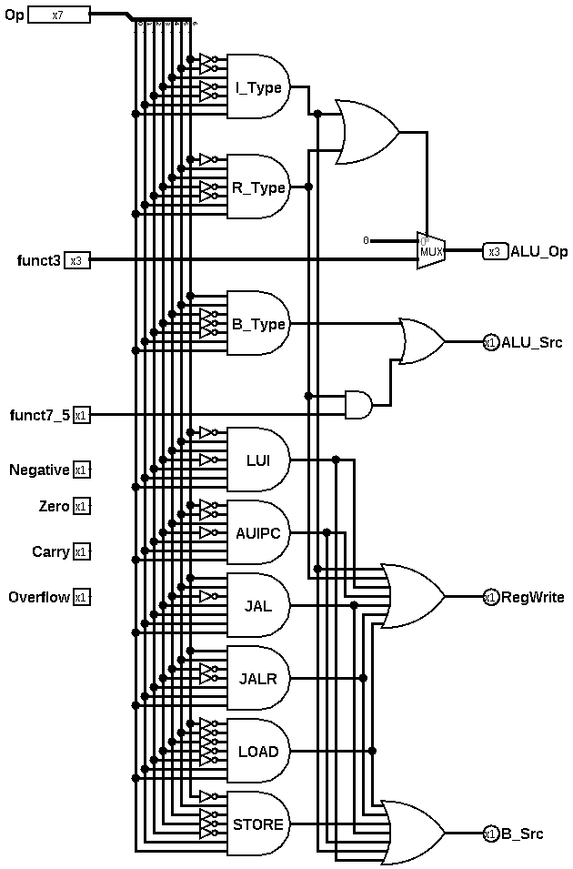

This is the completed circuit for the ADD instruction.

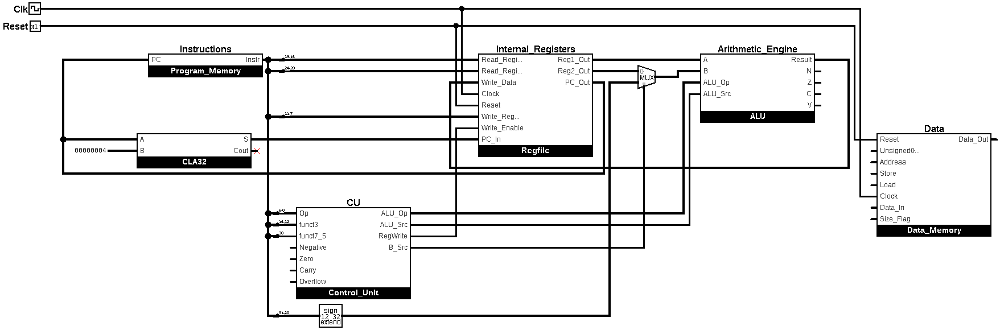

[Jump to Table of Contents](#table-of-contents)

### SUB

I've already made the necessary datapath modifications to support the SUB instruction. All I need to do is create the sample program to test this instruction.<br>

```
// x1 = 444 (ADDI x1, x0, 444)
1. 0x1BC00093

// x2 = 448 (ADDI x2, x0, 448)
2. 0x1C000113

// x3 = 3 (ADDI x3, x0, 3)
3. 0x00300193

// x4 = x1 - x2 = 444 - 448 = -4 (SUB x4, x1, x2)
4. 0x40208233

// x5 = x4 + x3 = -4 - 3 = -7 (SUB x5, x4, x3)
5. 0x403202B3
```

[Jump to Table of Contents](#table-of-contents)

### SLL

I've already made the necessary datapath modifications to support the SLL instruction. All I need to do is create the sample program to test this instruction.<br>

```
// x1 = 16 (ADDI x1, x0, 16)
1. 0x01000093

// x2 = 9 (ADDI x2, x0, 9)
2. 0x00900113

// x3 = 3 (ADDI x3, x0, 3)
3. 0x00300193

// x4 = x1 << x2 = 16 << 9 = 8192 (SLL x4, x1, x2)
4. 0x00209233

// x4 = x4 << x3 = 8192 << 3 = 65536 (SLL x4, x4, x3)
5. 0x00321233
```

[Jump to Table of Contents](#table-of-contents)

### SLT

I need to make some modifications to the datapath to support the SLT instruction. I need to add some extra logic to ALU_Src of the control unit. It needs to go high specifically on SLT, SLTU, SLTI and SLTIU instructions since they will be subtracting, not adding.

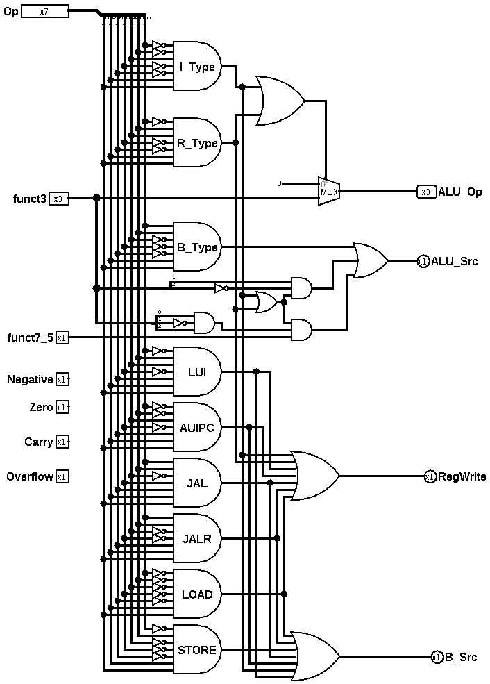

Now I can create the sample program.<br>

```
// x14 = -6 (ADDI x14, x0, -6)
1. 0xFFA00713

// x29 = 4 (ADDI x29, x0, 4)
2. 0x00400E93

// x31 = x14 < x29 = 1 (SLT x31, x14, x29)
3. 0x01D72FB3
```

[Jump to Table of Contents](#table-of-contents)

### SLTU

I've already made the necessary datapath modifications to support the SLTU instruction. All I need to do is create the sample program to test this instruction.<br>

```
// x14 = -6 = 4090 unsigned (ADDI x14, x0, -6)
1. 0xFFA00713

// x29 = 4 (ADDI x29, x0, 4)
2. 0x00400E93

// x31 = x14 (unsigned) < x29 (unsigned) = 0 (SLTU x31, x14, x29)
3. 0x01D73FB3
```

[Jump to Table of Contents](#table-of-contents)

### XOR

I've already made the necessary datapath modifications to support the XOR instruction. All I need to do is create the sample program to test this instruction.<br>

```
// x11 = 4032 = 0xFC0 (ADDI x11, x0, 4032)
1. 0xFC000593

// x7 = 4095 = 0xFFF (ADDI x7, x0, 4095)
2. 0xFFF00393

// x25 = x11 ^ x7 = 0xFC0 ^ 0xFFF = 0x03F = 63
3. 0x0075CCB3
```

[Jump to Table of Contents](#table-of-contents)

### SRL

I've already made the necessary datapath modifications to support the SRL instruction. All I need to do is create the sample program to test this instruction.<br>

```
// x1 = -16 = 0xFFFFFFF0 (ADDI x1, x0, -16)
1. 0xFF000093

// x2 = 4 (ADDI x2, x0, 4)
2. 0x00400113

// x3 = x1 >> x2 = 268435455 = 0x0FFFFFFF (SRL x3, x1, x2)
3. 0x0020D1B3
```

[Jump to Table of Contents](#table-of-contents)

### SRA

I've already made the necessary datapath modifications to support the SRA instruction. All I need to do is create the sample program to test this instruction.<br>

```
// x1 = -16 = 0xFFFFFFF0 (ADDI x1, x0, -16)
1. 0xFF000093

// x2 = 4 (ADDI x2, x0, 4)
2. 0x00400113

// x3 = x1 >> x2 = -1 = 0xFFFFFFFF (SRA x3, x1, x2)
3. 0x4020D1B3
```

[Jump to Table of Contents](#table-of-contents)

### OR

I've already made the necessary datapath modifications to support the OR instruction. All I need to do is create the sample program to test this instruction.<br>

```
// x11 = 802 = 0x321 (ADDI x11, x0, 801)
1. 0x32100593

// x7 = 1160 = 0x488 (ADDI x7, x0, 1160)
2. 0x48800393

// x25 = x11 | x7 = 0x321 | 0x488 = 0x7A9 = 1961 (OR x25, x11, x7)
3. 0x0075ECB3
```

[Jump to Table of Contents](#table-of-contents)

### AND

I've already made the necessary datapath modifications to support the AND instruction. All I need to do is create the sample program to test this instruction.<br>

```
// x11 = 802 = 0x321 (ADDI x11, x0, 801)
1. 0x32100593

// x7 = 1638 = 0x666 (ADDI x7, x0, 1638)
2. 0x66600393

// x25 = x11 & x7 = 0x321 & 0x666 = 0x220 = 554 (AND x25, x11, x7)
3. 0x0075FCB3
```

[Jump to Table of Contents](#table-of-contents)

### SLLI

I've already made the necessary datapath modifications to support the SLLI instruction. All I need to do is create the sample program to test this instruction.<br>

```
// x1 = 2 (ADDI x1, x0, 2)
1. 0x00200093

// x1 = x1 << 5 = 64 (SLLI x1, x1, 5)
2. 0x00509093
```

[Jump to Table of Contents](#table-of-contents)

### SLTI

I've already made the necessary datapath modifications to support the SLTI instruction. All I need to do is create the sample program to test this instruction.<br>

```
// x1 = 2 (ADDI x1, x0, -336)
1. 0xEB000093

// x2 = x1 < 5 = 1 (SLTI x2, x1, 5)
2. 0x0050A113
```

[Jump to Table of Contents](#table-of-contents)

### SLTIU

I've already made the necessary datapath modifications to support the SLTIU instruction. All I need to do is create the sample program to test this instruction.<br>

```
// x1 = 2 (ADDI x1, x0, -336)
1. 0xEB000093

// x2 = x1 < 5 = 0 (SLTIU x2, x1, 5)
2. 0x0050B113
```

[Jump to Table of Contents](#table-of-contents)

### XORI

I've already made the necessary datapath modifications to support the XORI instruction. All I need to do is create the sample program to test this instruction.<br>

```
// x1 = -64 = 0xFFFFFFC0 (ADDI x1, x0, -64)
1. 0xFC000093

// x2 = x1 ^ -1 = 0xFFFFFFC0 ^ 0xFFFFFFFF = 0x0000003F = 63 (XORI x2, x1, -1)
2. 0xFFF0C113
```

[Jump to Table of Contents](#table-of-contents)

### SRLI

I've already made the necessary datapath modifications to support the SRLI instruction. All I need to do is create the sample program to test this instruction.<br>

```
// x1 = -64 = 0xFFFFFFC0 (ADDI x1, x0, -64)
1. 0xFC000093

// x2 = x1 >> 3 = 0xFFFFFFC0 >> 3 = 0x1FFFFFF8 (SRLI x2, x1, 3)
2. 0x0030D113
```

[Jump to Table of Contents](#table-of-contents)

### SRAI

I've already made the necessary datapath modifications to support the SRAI instruction. All I need to do is create the sample program to test this instruction.<br>

```
// x1 = -64 = 0xFFFFFFC0 (ADDI x1, x0, -64)
1. 0xFC000093

// x2 = x1 >> 3 = 0xFFFFFFC0 >> 3 = 0xFFFFFFF8 (SRAI x2, x1, 3)
2. 0x4030D113
```

[Jump to Table of Contents](#table-of-contents)

### ORI

I've already made the necessary datapath modifications to support the ORI instruction. All I need to do is create the sample program to test this instruction.<br>

```
// x1 = 801 = 0x321 (ADDI x1, x0, 801)
1. 0x32100093

// x2 = x1 | 1160 = 0x321 | 0x488 = 0x7A9 = 1961 (ORI x2, x1, 1160)
2. 0x4880E113
```

[Jump to Table of Contents](#table-of-contents)

### ANDI

I've already made the necessary datapath modifications to support the ANDI instruction. All I need to do is create the sample program to test this instruction.<br>

```
// x1 = 801 = 0x321 (ADDI x1, x0, 801)
1. 0x32100093

// x25 = x1 & 1638 = 0x321 & 0x666 = 0x220 = 554 (ANDI x2, x1, 1638)
2. 0x6660F113
```

[Jump to Table of Contents](#table-of-contents)

### SB/LB/LBU

Now all of the arithmetic/logical operations are implemented. It's time to implement memory-based instructions (store/load). To implement the store instructions (SW/SH/SB), I have to make more adjustments to the Control Unit. The Control Unit now has to output these signals:

- MemSigned: This signals to the Data memory controller to sign extend a loaded value.
	- This signal only goes high only on these load instructions: LB and LH
- MemWrite: This enables the data memory block to store a value.
	- This signal only goes high on store instructions (SW/SH/SB)
- MemRead: This enables the data memory block to read a value.
	- This signal only goes high on load instructions (LW/LH/LHU/LB/LBU)
- Size_Flag: This tells the data memory block if the CPU is storing/loading a byte, a half word, or full word
	- Size_Flag[1]: Since Size_Flag = 11 means invalid, I actually only care about when Size_Flag[1] is zero. Size_Flag[1] is zero only on these instructions: LB, LBU, LH, LHU, SB, and SH.
	- Size_Flag[0]: Since Size_Flag = 11 means invalid, I actually only care about when Size_Flag[0] is zero. Size_Flag[0] is zero only on these instructions: LB, LBU, LW, SB, and SW.

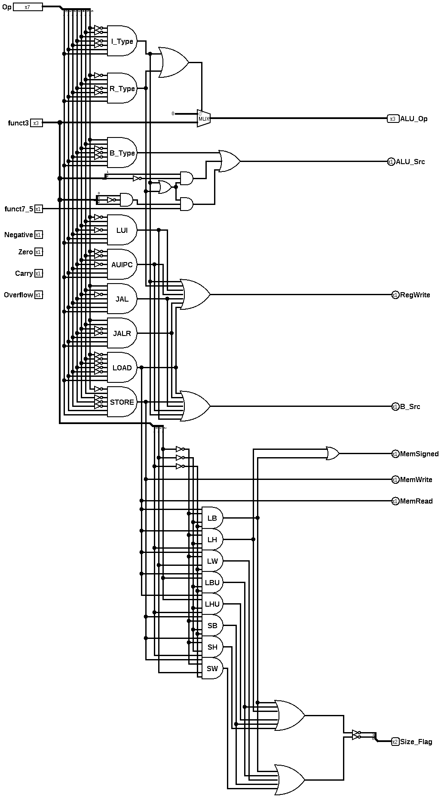

In the top-level circuit, I need to connect the ALU result to the Address port of the data memory since the ALU will add offsets for target address on data memory. Also, I'll connect the new outputs of the control unit to the appropriate ports of the data memory. Since for store instructions, rs2 is the source register that carries the value to store in data memory, I'll connect Reg2_Out to Data_In of the Data Memory block.<br>

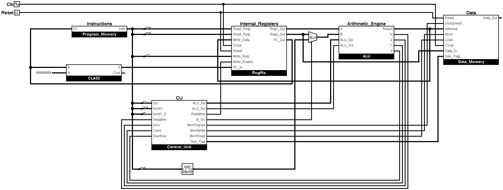

Because the store instruction now has the immediate bits separated, the CPU needs to control two different immediate sources: one from Instruction[31:20] or Instruction[31:25,11:7]. To select between the two, I'll use a multiplexer and the MemWrite output from the Control Unit will act as the selector since the CPU uses Instruction[31:25,11:7] to generate the immediate only on store instructions.


For the final piece of the puzzle, now I need to connect Data_Out from the Data Memory block to the Write_Data that is already taken by the ALU Result. I will simply add another multiplexer that will select whether to use the ALU Result or the Data Out from memory. The MemRead output from the Control Unit will act as the selector.

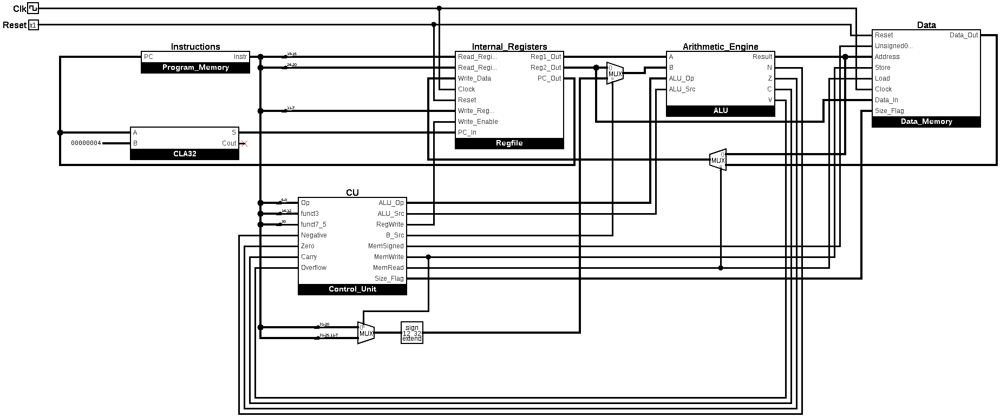

As usual, I have to create a sample program to test the SB instruction.

```
//x9 = -144 (ADDI x9, x0, -115)
1. 0xF8D00493

//x22 = 20 (ADDI x22, x0, 20)
2. 0x01400B13

//Mem[x22 + 36] = Mem[20 + 36] = Mem[56] = x9 = -115 (SB x9, 36(x22))
3. 0x029B0223

//x3 = 56 (ADDI x3, x0, 56)
4. 0x03800193

//x1 = Mem[x3 + 0] = Mem[56] = 0xFFFFFF8D = -115 (LB x1, 0(x3))
5. 0x00018083

//x2 = Mem[x3 + 0] (Unsigned) = Mem[56] (Unsigned) = 0x0000008D = 141 (LBU x2, 0(x3))
6. 0x0001C103
```

[Jump to Table of Contents](#table-of-contents)

### SH/LH/LHU

I've already made the necessary datapath modifications to support the SH/LH/LHU instructions. All I need to do is create the sample program to test these instructions.<br>

```
//x9 = -144 (ADDI x9, x0, -115)
1. 0xF8D00493

//x22 = 20 (ADDI x22, x0, 20)
2. 0x01400B13

//Mem[x22 + 36] = Mem[20 + 36] = Mem[56] = x9 = -115 (SH x9, 36(x22))
3. 0x029B1223

//x3 = 56 (ADDI x3, x0, 56)
4. 0x03800193

//x1 = Mem[x3 + 0] = Mem[57,56] = 0xFFFFFF8D = -115 (LH x1, 0(x3))
5. 0x00019083

//x2 = Mem[x3 + 0] (Unsigned) = Mem[57,56] (Unsigned) = 0x0000FF8D = 65421 (LHU x2, 0(x3))
6. 0x0001D103
```

[Jump to Table of Contents](#table-of-contents)

### SW/LW

I've already made the necessary datapath modifications to support the SH/LH/LHU instructions. All I need to do is create the sample program to test these instructions.<br>

```
//x1 = 0x00000067 (ADDI x1, x0, 103)
1. 0x06700093

//x1 = x1 << 8 = 0x00006700 (SLLI x1, x1, 8)
2. 0x00809093

//x1 = x1 + 165 = 0x000067A5 (ADDI x1, x1, 165)
3. 0x0A508093

//x1 = x1 << 8 = 0x0067A500 (SLLI x1, x1, 8)
4. 0x00809093

//x1 = x1 + 244 = 0x0067A5F4 (ADDI x1, x1, 244)
5. 0x0F408093

//x1 = x1 << 8 = 0x67A5F400 (SLLI x1, x1, 8)
6. 0x00809093

//x1 = x1 + 156 = 0x67A5F49C (ADDI x1, x1, 156)
7. 0x09C08093

//x2 = 0x00000033 (ADDI x2, x0, 51)
8. 0x03300113

//x2 = x2 << 8 = 0x00003300 (SLLI x2, x2, 8)
9. 0x00811113

//x2 = x2 + 85 = 0x00003355 (ADDI x2, x2, 85)
10. 0x05510113

//x2 = x2 << 8 = 0x00335500 (SLLI x2, x2, 8)
11. 0x00811113

//x2 = x2 + 200 = 0x003355C8 (ADDI x2, x2, 200)
12. 0x0C810113

//Mem[x2 + 2000] = Mem[3364296 + 2000] = Mem[3366296] = x1 = 0x67A5F49C (SW x1, 2000(x2))
13. 0x7C112823

//x3 = Mem[x2 + 2000] = 0x67A5F49C (LW x3, 2000(x2))
14. 0x7D012183
```

[Jump to Table of Contents](#table-of-contents)

### BEQ
### BNE
### BLT
### BGE
### BLTU
### BGEU

### LUI
### AUIPC
### JAL
### JALR

# Part IV: Implementing RV32I (Pipelined Architecture)

[TBA]

[Jump to Table of Contents](#table-of-contents)

# Special Thanks

I'm dedicating this section to the wonderful people at the [Digital Design HQ discord](https://discord.gg/4YWKUryprY) who have helped me build this project.
- [Mahir Abbas](https://github.com/MahirAbbas)
- [Andrew Clark (FL4SHK)](https://github.com/fl4shk)
- [sarvel](https://sarvel.xyz/)

[Jump to Table of Contents](#table-of-contents)
