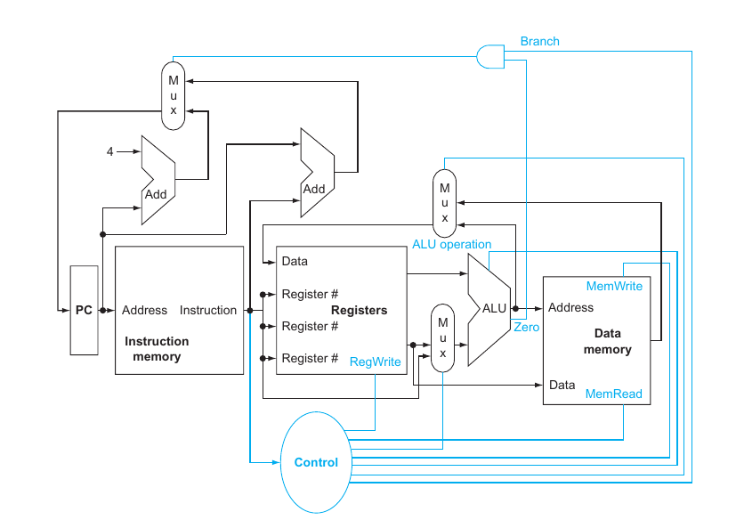

# Overview

This is documentation for my CPU design.

Logisim - Contains my Logisim schematic of my RISC-V implementation.
Vivado - Contains the Vivado project of my RISC-V implementation.

# Part 1.1: Creating Non-Pipelined RISC-V CPU

As far as ISA I want to build this CPU off of, I want to make a CPU based on the RISC-V ISA.

I'm using this CPU Design as a model for my datapath 

This is from David A. Patterson's and John L. Hennessy's RISC-V Edition of Computer Organization and Design.

The goal here is to initially create a basic processor with idealized memory and no pipelining. Later, I will implement more advanced features.

## Vivado (2022.2)

I'm using the [Unprivileged RISC-V Instruction Set Manual (Volume 1)](https://riscv.org/wp-content/uploads/2019/12/riscv-spec-20191213.pdf) published in December 2019 as reference. Language I'll be primarily using is VHDL, since I'm tired of using Verilog lol.

Just to make this easy on me since I'm a noob (at the time of this edit), I'll start by implementing the RV32I variant since it seems according to the spec sheet, that architecture serves as the basis for the RISC-V extensions.

### Program Counter

### Instruction Decoder

In **Page 129** of the manual, it describes the instruction layout is explained. I don't want to repeat a bunch of info from the manual. You can read it yourself, so I'll just parse out very important notes here so you don't have to read the manuals. This [article](https://msyksphinz-self.github.io/riscv-isadoc/html/index.html) provides more detailed descriptions of the individual instructions for the base ISA and the extensions.

# Part 1.2: TBD

TBD
