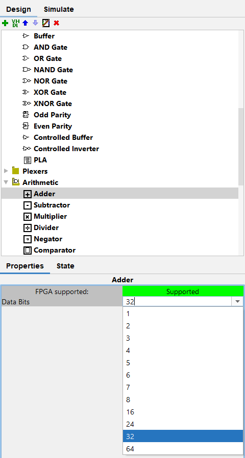
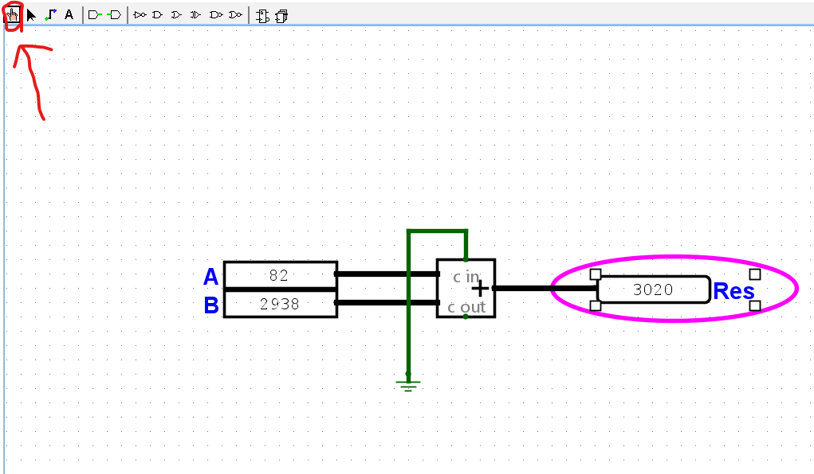
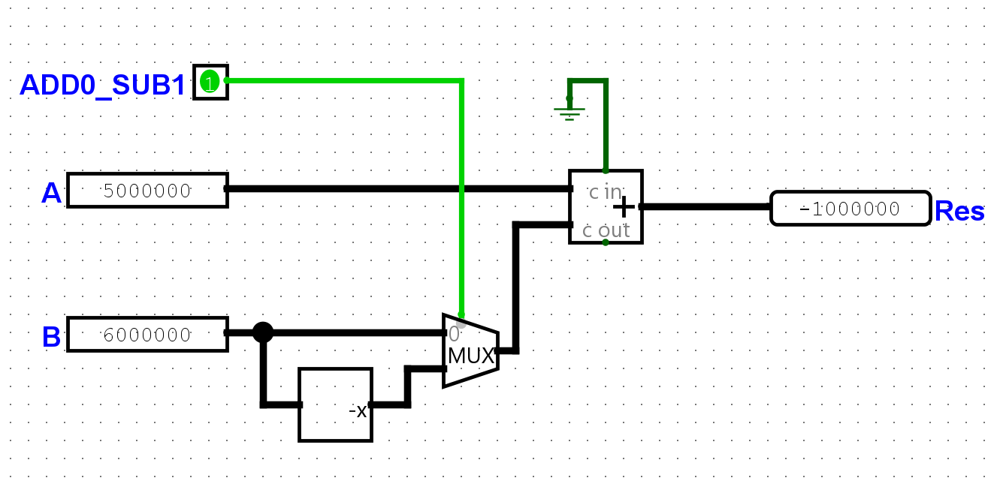
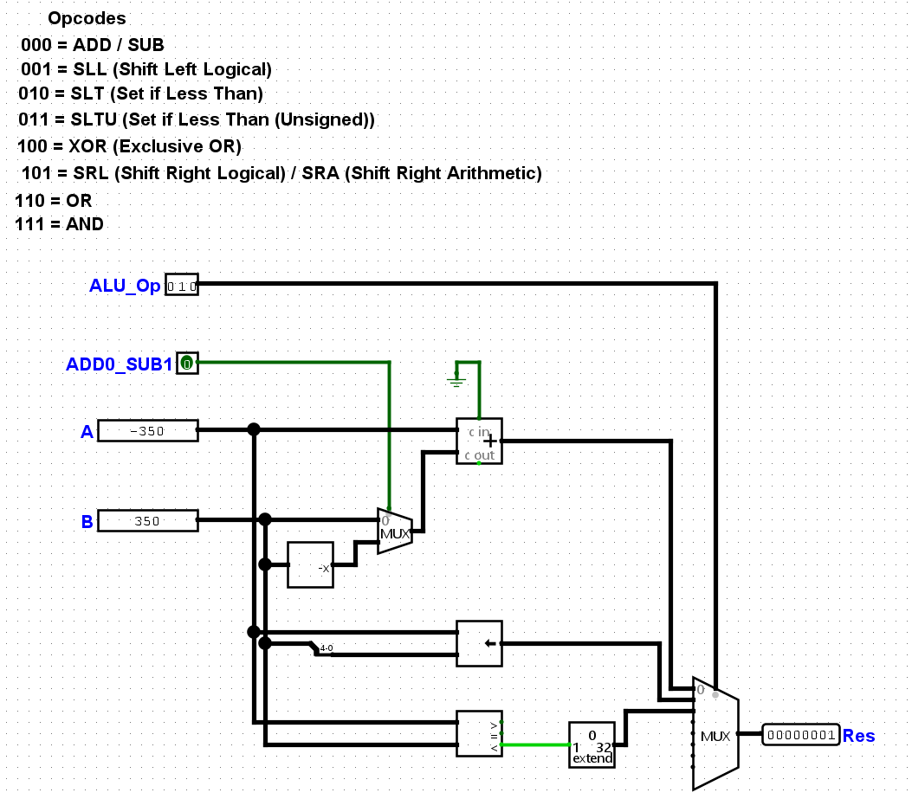
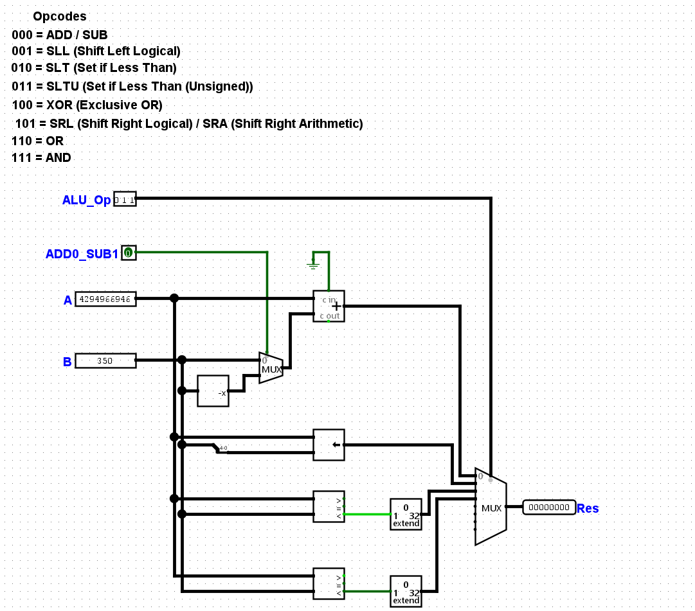
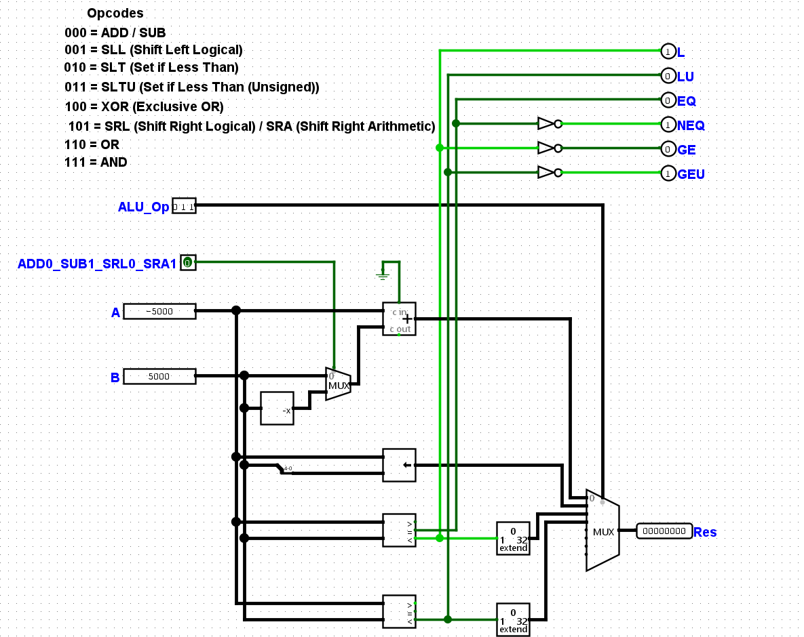

# Overview

This is documentation for my CPU design and a journal of my learning experience. I will write this README in a manner to document everything I'm doing so the more experienced can better guide me to improve my design and the "not-so-experienced" like myself can have an easy, accessible manual on how to design a CPU to prove that it's not as daunting as they may believe. Yeah, it's easy to say this when you already know what you're doing, but I think it would be interesting to see a project like this develop as you're reading this. 

This is from David A. Patterson's and John L. Hennessy's RISC-V Edition of Computer Organization and Design and will serve as a basis for my design.

The goal here is to initially create a basic processor with idealized memory and no pipelining. Later, I will implement more advanced features. 

I'm using the [Unprivileged RISC-V Instruction Set Manual (Volume 1)](./unpriv-isa-asciidoc.pdf) published in May 2024 as reference. Just to make this easy on me since I'm a noob (at this point in the project), I'll start by implementing the RV32I variant since according to the spec sheet, that architecture serves as the basis for the RISC-V extensions. This base set only handles integer instructions of an XLEN (term that determines the data size) of 32, which means the register sizes are 32 bits. I will learn the privileged set much later on. I assume the privileged set is for operating systems.

# Table of Contents

# Prerequisite Material

Prepping for this, someone directed to me to a game on Steam called [Turing Complete](https://store.steampowered.com/app/1444480/Turing_Complete/), which is a puzzle game to help you learn about CPU architecture design. It's surprisingly really good and I enjoyed it to as Digital Logic review. It also has a Sandbox mode to where I can design my CPU there. Normally, it's $20. However, if you are looking something for free, there are plenty of resources online. A few I can personally recommend are:

- [All About Circuits](https://www.allaboutcircuits.com/textbook/digital/)
- [GeeksforGeeks](https://www.geeksforgeeks.org/digital-electronics-logic-design-tutorials/)
- [Neso Academy - Digital Electronics YouTube Playlist](https://www.youtube.com/playlist?list=PLBlnK6fEyqRjMH3mWf6kwqiTbT798eAOm)

For the rest of this README, I will assume you have at least some basic digital design knowledge for the purposes of conciseness so I don't go in-depth with literally everything I'm dong.

# Part I: Learning the RISC-V ISA (RV32I)

I am new to RISC-V and I'll try my best to summarize the RISC-V base spec with the most important details to help me design my CPU. Let's keep it real, you're not reading and memorizing the whole 670-page spec.

## Registers Table

| Register Table 	|                          Description                         	|
|----------------	|:------------------------------------------------------------:	|
|       x0       	|           General Purpose Register (Hardwired to 0)          	|
|       x1       	| 		    General Purpose Register  			|
|       x2       	|                   General Purpose Register 			|
|       x3       	|                   General Purpose Register                   	|
|       x4       	|                   General Purpose Register                   	|
|       x5       	|                   General Purpose Register 			|
|       x6       	|                   General Purpose Register                   	|
|       x7       	|                   General Purpose Register                   	|
|       x8       	|                   General Purpose Register                   	|
|       x9       	|                   General Purpose Register                   	|
|       x10      	|                   General Purpose Register                   	|
|       x11      	|                   General Purpose Register                   	|
|       x12      	|                   General Purpose Register                   	|
|       x13      	|                   General Purpose Register                   	|
|       x14      	|                   General Purpose Register                   	|
|       x15      	|                   General Purpose Register                   	|
|       x16      	|                   General Purpose Register                   	|
|       x17      	|                   General Purpose Register                   	|
|       x18      	|                   General Purpose Register                   	|
|       x19      	|                   General Purpose Register                   	|
|       x20      	|                   General Purpose Register                   	|
|       x21      	|                   General Purpose Register                   	|
|       x22      	|                   General Purpose Register                   	|
|       x23      	|                   General Purpose Register                   	|
|       x24      	|                   General Purpose Register                   	|
|       x25      	|                   General Purpose Register                   	|
|       x26      	|                   General Purpose Register                   	|
|       x27      	|                   General Purpose Register                   	|
|       x28      	|                   General Purpose Register                   	|
|       x29      	|                   General Purpose Register                   	|
|       x30      	|                   General Purpose Register                   	|
|       x31      	|                   General Purpose Register                   	|
|       pc       	|             Stores Current Program Counter Value             	|

 

In a hardware point-of-view, there is no dedicated register for special purposes such as the return address, with exception to the program counter register. All of these registers (with exception to the x0 register and pc register) can be used for anything. However, in standard convention, assembly programmers typically use the same registers for special purposes. I'm not going to bother documenting it in this README but if you're curious, take a look at [Chapter 25 of the 2019 release spec](https://riscv.org/wp-content/uploads/2019/12/riscv-spec-20191213.pdf). For some reason, this segment was removed in the 2024 spec release.

## Instruction Types

There are 6 instruction types:
1. R: Register-to-Register
2. I: Short Immediate / Load
3. S: Store
4. B: Conditional Branch
5. U: Long Immediate
6. J: Unconditional Jumps

## Instruction Formatting

### R-Type (Register-Register)

The R-type instruction is a core instruction type that takes two source registers (rs1 and rs2), performs arithmetic/logical operations, and places the results in the destination register (rd). There are 6 fields:
1. funct7 - This is a 7 bit field that selects the type of operation given the opcode and funct3 fields.
2. rs2 - This is a 5 bit field that selects a register as the second operand for the arithmetic/logical operation.
3. rs1 - This is a 5 bit field that selects a register as the first operand for the arithmetic/logical operation.
4. funct3 - This is a 3 bit field that selects the type of operation given the opcode and funct7 fields.
5. rd - This is a 5 bit field that selects the destination register for the arithmetic/logical operation result.
6. opcode - This is a 7 bit field that selects the type of operation.

|     31    	|     30    	|     29    	|     28    	|     27    	|     26    	|     25    	|   24   	|   23   	|   22   	|   21   	|   20   	|   19   	|   18   	|   17   	|   16   	|   15   	|     14    	|     13    	|     12    	|   11  	|   10  	|   9   	|   8   	|   7   	|     6     	|     5     	|     4     	|     3     	|     2     	|     1     	|     0     	|
|:---------:	|:---------:	|:---------:	|:---------:	|:---------:	|:---------:	|:---------:	|:------:	|:------:	|:------:	|:------:	|:------:	|:------:	|:------:	|:------:	|:------:	|:------:	|:---------:	|:---------:	|:---------:	|:-----:	|:-----:	|:-----:	|:-----:	|:-----:	|:---------:	|:---------:	|:---------:	|:---------:	|:---------:	|:---------:	|:---------:	|
| funct7[6] 	| funct7[5] 	| funct7[4] 	| funct7[3] 	| funct7[2] 	| funct7[1] 	| funct7[0] 	| rs2[4] 	| rs2[3] 	| rs2[2] 	| rs2[1] 	| rs2[0] 	| rs1[4] 	| rs1[3] 	| rs1[2] 	| rs1[1] 	| rs1[0] 	| funct3[2] 	| funct3[1] 	| funct3[0] 	| rd[4] 	| rd[3] 	| rd[2] 	| rd[1] 	| rd[0] 	| opcode[6] 	| opcode[5] 	| opcode[4] 	| opcode[3] 	| opcode[2] 	| opcode[1] 	| opcode[0] 	|

### I-Type (Register-Immediate)

The I-type instruction is a core instruction type that handles short immediates and loading operations. The I-type takes one source register (rs1), performs arithmetic/logical operations on an immediate value that is 12 bits wide, and places the results in the destination register (rd). There are 5 fields:
1. immediate - This is a 12 bit field that represents the sign-extended immediate value to use for the immediate instruction.
2. rs1 - This is a 5 bit field that selects a register as the first operand for the arithmetic/logical operation.
3. funct3 - This is a 3 bit field that selects the type of operation given the opcode field.
4. rd - This is a 5 bit field that selects the destination register for the arithmetic/logical operation result.
5. opcode - This is a 7 bit field that selects the type of operation.

|    31   	|    30   	|   29   	|   28   	|   27   	|   26   	|   25   	|   24   	|   23   	|   22   	|   21   	|   20   	|   19   	|   18   	|   17   	|   16   	|   15   	|     14    	|     13    	|     12    	|   11  	|   10  	|   9   	|   8   	|   7   	|     6     	|     5     	|     4     	|     3     	|     2     	|     1     	|     0     	|
|:-------:	|:-------:	|:------:	|:------:	|:------:	|:------:	|:------:	|:------:	|:------:	|:------:	|:------:	|:------:	|:------:	|:------:	|:------:	|:------:	|:------:	|:---------:	|:---------:	|:---------:	|:-----:	|:-----:	|:-----:	|:-----:	|:-----:	|:---------:	|:---------:	|:---------:	|:---------:	|:---------:	|:---------:	|:---------:	|
| imm[11] 	| imm[10] 	| imm[9] 	| imm[8] 	| imm[7] 	| imm[6] 	| imm[5] 	| imm[4] 	| imm[3] 	| imm[2] 	| imm[1] 	| imm[0] 	| rs1[4] 	| rs1[3] 	| rs1[2] 	| rs1[1] 	| rs1[0] 	| funct3[2] 	| funct3[1] 	| funct3[0] 	| rd[4] 	| rd[3] 	| rd[2] 	| rd[1] 	| rd[0] 	| opcode[6] 	| opcode[5] 	| opcode[4] 	| opcode[3] 	| opcode[2] 	| opcode[1] 	| opcode[0] 	|

Notice how the funct7 and rs2 fields from the R-type instruction are combined to a 12-bit total immediate field. 

### S-Type (Store)

The S-type instruction is a core instruction type that handles storing data in memory. The first source register (rs1) is used as a base address value. The value of the second source register (rs2) is used to store in memory. The immediate value is used to add to rs1's value as an offset. Use this formula as reference:

- Memory[rs1+imm] = rs2

There are 6 fields total but there are 5 variables with one of them being split into 2 fields (immediate):
1. immediate[11:5] - This is a 7 bit field of the immediate value containing bits 11 to 5.
2. rs2 - This is a 5 bit field that selects a register as the second operand for the arithmetic/logical operation.
3. rs1 - This is a 5 bit field that selects a register as the first operand for the arithmetic/logical operation.
4. funct3 - This is a 3 bit field that selects the type of operation given the opcode field.
5. immediate[4:0] - This is a 5 bit field of the immediate value containing bits 4 to 0.
6. opcode - This is a 7 bit field that selects the type of operation.

|    31   	|    30   	|   29   	|   28   	|   27   	|   26   	|   25   	|   24   	|   23   	|   22   	|   21   	|   20   	|   19   	|   18   	|   17   	|   16   	|   15   	|     14    	|     13    	|     12    	|   11   	|   10   	|    9   	|    8   	|    7   	|     6     	|     5     	|     4     	|     3     	|     2     	|     1     	|     0     	|
|:-------:	|:-------:	|:------:	|:------:	|:------:	|:------:	|:------:	|:------:	|:------:	|:------:	|:------:	|:------:	|:------:	|:------:	|:------:	|:------:	|:------:	|:---------:	|:---------:	|:---------:	|:------:	|:------:	|:------:	|:------:	|:------:	|:---------:	|:---------:	|:---------:	|:---------:	|:---------:	|:---------:	|:---------:	|
| imm[11] 	| imm[10] 	| imm[9] 	| imm[8] 	| imm[7] 	| imm[6] 	| imm[5] 	| rs2[4] 	| rs2[3] 	| rs2[2] 	| rs2[1] 	| rs2[0] 	| rs1[4] 	| rs1[3] 	| rs1[2] 	| rs1[1] 	| rs1[0] 	| funct3[2] 	| funct3[1] 	| funct3[0] 	| imm[4] 	| imm[3] 	| imm[2] 	| imm[1] 	| imm[0] 	| opcode[6] 	| opcode[5] 	| opcode[4] 	| opcode[3] 	| opcode[2] 	| opcode[1] 	| opcode[0] 	|

Notice how the funct7 field from the R-type instruction is replaced with imm[11:5] and rd is replaced with imm[4:0].

### B-Type (Branch (Conditional Jump))

The B-type instruction is an extension of the S-type instruction that compares two registers (rs1 and rs2). Assuming the branch will be taken, the 12-bit immediate value is used as an offset to the current program counter value to "jump" to the target address. Because the offset is 12 bits wide and the offset is in terms of 2 bytes, the branch range is +/- 4KiB. There are 6 fields total but there are 5 variables with one of them being split into 2 fields (immediate):
1. immediate[12,10:5] - This is a 7 bit field of the immediate value containing bits 12 and 10 to 5 with bit 12 replacing bit 11 from the S-type instruction.
2. rs2 - This is a 5 bit field that selects a register as the second operand for the arithmetic/logical operation.
3. rs1 - This is a 5 bit field that selects a register as the first operand for the arithmetic/logical operation.
4. funct3 - This is a 3 bit field that selects the type of operation given the opcode field.
5. immediate[4:1,11] - This is a 5 bit field of the immediate value containing bits 4 to 1 and 11 with bit 11 replacing bit 0 from the S-type instruction.
6. opcode - This is a 7 bit field that selects the type of operation.

|    31   	|    30   	|   29   	|   28   	|   27   	|   26   	|   25   	|   24   	|   23   	|   22   	|   21   	|   20   	|   19   	|   18   	|   17   	|   16   	|   15   	|     14    	|     13    	|     12    	|   11   	|   10   	|    9   	|    8   	|    7    	|     6     	|     5     	|     4     	|     3     	|     2     	|     1     	|     0     	|
|:-------:	|:-------:	|:------:	|:------:	|:------:	|:------:	|:------:	|:------:	|:------:	|:------:	|:------:	|:------:	|:------:	|:------:	|:------:	|:------:	|:------:	|:---------:	|:---------:	|:---------:	|:------:	|:------:	|:------:	|:------:	|:-------:	|:---------:	|:---------:	|:---------:	|:---------:	|:---------:	|:---------:	|:---------:	|
| imm[12] 	| imm[10] 	| imm[9] 	| imm[8] 	| imm[7] 	| imm[6] 	| imm[5] 	| rs2[4] 	| rs2[3] 	| rs2[2] 	| rs2[1] 	| rs2[0] 	| rs1[4] 	| rs1[3] 	| rs1[2] 	| rs1[1] 	| rs1[0] 	| funct3[2] 	| funct3[1] 	| funct3[0] 	| imm[4] 	| imm[3] 	| imm[2] 	| imm[1] 	| imm[11] 	| opcode[6] 	| opcode[5] 	| opcode[4] 	| opcode[3] 	| opcode[2] 	| opcode[1] 	| opcode[0] 	|

Notice how imm[0] is replaced with imm[11] from the S-type instruction and taking its place is imm[12].

### U-Type (Long Immediate)

The U-type instruction is a core instruction type that handles long immediates, unlike I-type instructions that handle short immediates. Short immediate (I-type) instructions handles immediate values up to 12 bits. U-type instructions can handle immediate values up to 20 bits that are then shifted by 12 bits to form upper immediates to place into the destination register (rd). There are 3 bit fields:
1. immediate[31:12] - The 20 bit immediate value that is shifted left by 12 bits to load the upper 20 bits of a register value. To load an immediate value that is greater than a 20 bit value, simply load upper immediate (load upper 20 bits and then add immediate for the rest of the lower 12 bits.
2. rd - This is a 5 bit field that selects the destination register to store the upper immediate value.
3. opcode - This is a 7 bit field that selects the type of operation.

|    31   	|    30   	|    29   	|    28   	|    27   	|    26   	|    25   	|    24   	|    23   	|    22   	|    21   	|    20   	|    19   	|    18   	|    17   	|    16   	|    15   	|    14   	|    13   	|    12   	|   11  	|   10  	|   9   	|   8   	|   7   	|     6     	|     5     	|     4     	|     3     	|     2     	|     1     	|     0     	|
|:-------:	|:-------:	|:-------:	|:-------:	|:-------:	|:-------:	|:-------:	|:-------:	|:-------:	|:-------:	|:-------:	|:-------:	|:-------:	|:-------:	|:-------:	|:-------:	|:-------:	|:-------:	|:-------:	|:-------:	|:-----:	|:-----:	|:-----:	|:-----:	|:-----:	|:---------:	|:---------:	|:---------:	|:---------:	|:---------:	|:---------:	|:---------:	|
| imm[31] 	| imm[30] 	| imm[29] 	| imm[28] 	| imm[27] 	| imm[26] 	| imm[25] 	| imm[24] 	| imm[23] 	| imm[22] 	| imm[21] 	| imm[20] 	| imm[19] 	| imm[18] 	| imm[17] 	| imm[16] 	| imm[15] 	| imm[14] 	| imm[13] 	| imm[12] 	| rd[4] 	| rd[3] 	| rd[2] 	| rd[1] 	| rd[0] 	| opcode[6] 	| opcode[5] 	| opcode[4] 	| opcode[3] 	| opcode[2] 	| opcode[1] 	| opcode[0] 	|

Notice how the funct7, rs2, rs1, and funct3 bit fields from the R-type instruction format are replaced by the wide 20-bit immediate value.

### J-Type (Unconditional Jump)

The J-type instruction is an extension of the U-type instruction that unconditionally "jumps" or changes the program counter value by saving the current program counter (PC + 4) to rd. The reason this is done is for "jump and link" (JAL) instructions. When entering a subroutine, the program counter before entering the subroutine must be saved so the program can gracefully resume work after returning from the subroutine. After saving the current program counter, the program counter is then added using the immediate offset value to perform the "jump". There are 3 bit fields:
1. immediate[20,10:1,11,19:12] - The 20 bit immediate value that is used as the offset to add to the current program counter for jumping.
2. rd - This is a 5 bit field that selects the destination register to store the current program counter for returning from a subroutine. This is also called the "return address". The difference here is that there is no dedicated "return address register".
3. opcode - This is a 7 bit field that selects the type of operation.

|    31   	|    30   	|   29   	|   28   	|   27   	|   26   	|   25   	|   24   	|   23   	|   22   	|   21   	|    20   	|    19   	|    18   	|    17   	|    16   	|    15   	|    14   	|    13   	|    12   	|   11  	|   10  	|   9   	|   8   	|   7   	|     6     	|     5     	|     4     	|     3     	|     2     	|     1     	|     0     	|
|:-------:	|:-------:	|:------:	|:------:	|:------:	|:------:	|:------:	|:------:	|:------:	|:------:	|:------:	|:-------:	|:-------:	|:-------:	|:-------:	|:-------:	|:-------:	|:-------:	|:-------:	|:-------:	|:-----:	|:-----:	|:-----:	|:-----:	|:-----:	|:---------:	|:---------:	|:---------:	|:---------:	|:---------:	|:---------:	|:---------:	|
| imm[20] 	| imm[10] 	| imm[9] 	| imm[8] 	| imm[7] 	| imm[6] 	| imm[5] 	| imm[4] 	| imm[3] 	| imm[2] 	| imm[1] 	| imm[11] 	| imm[19] 	| imm[18] 	| imm[17] 	| imm[16] 	| imm[15] 	| imm[14] 	| imm[13] 	| imm[12] 	| rd[4] 	| rd[3] 	| rd[2] 	| rd[1] 	| rd[0] 	| opcode[6] 	| opcode[5] 	| opcode[4] 	| opcode[3] 	| opcode[2] 	| opcode[1] 	| opcode[0] 	|

Notice how the immediate field from the U-type instruction is roughly the same except the J-type instruction shifted the bits around to include a "20th" bit. Remember, when it comes to jumping or branching, the program counter offset always in terms of 2 bytes. The reason this is so the program counter never points to an odd address. 

### I/O Instructions (Memory Ordering)

As far as I can interpret, these instructions are used to make sure other processing cores can see instructions and execute instructions in the "predecessor set" (before the FENCE instruction) in order before the "successor set" (after the FENCE instruction). I presume this is a flag for reorder buffers to restrict hardware threads from executing preceeding instructions out of order relative to the memory fence. I'm learning this from Chapter 2.7 of the official spec and [this stackoverflow page](https://stackoverflow.com/questions/286629/what-is-a-memory-fence). There are 6 bit fields:
1. Fence Mode (fm) - This is a 4 bit field that indicates the fence mode.
	- 0000 = Normal Fence
	- 1000 = TSO Mode (Orders all load operations in the predecessor set before all memory operations in its successor set and all store operations in its predecessor set before all store operations in its successor set.
2. Memory Type Instructions - This is an 8 bit field that dictates what combination of instruction types in the preceeding set to order relative to the combination of instruction types in the succeeding set.
	- PI = Preceeding Input/Output Reads (Setting this to "1" will order Device I/O Reads in the predecessor set)
	- PO = Preceeding Input/Output Writes (Setting this to "1" will order Device I/O Writes in the predecessor set)
	- PR = Preceeding Memory Reads (Setting this to "1" will order Memory Reads in the predecessor set)
	- PW = Preceeding Memory Writes (Setting this to "1" will order Memory Writes in the predecessor set)
	- SI = Succeeding Input/Output Reads (Setting this to "1" will order Device I/O Reads in the successor set)
	- SO = Succeeding Input/Output Writes (Setting this to "1" will order Device I/O Writes in the successor set)
	- SR = Succeeding Memory Reads (Setting this to "1" will order Memory Reads in the successor set)
	- SW = Succeeding Memory Writes (Setting this to "1" will order Memory Writes in the successor set)
3. rs1 - This is a 5 bit field that indicates, I presume to be a programmable predecessor set(?). According to the spec sheet, rs1 and rd are typically reserved for future extensions. It is standard practice to zero out these fields for forward compatibility.
4. funct3 - This is a 3 bit field that selects the type of operation given the opcode field.
5. rd - This is a 5 bit field that indicates, I presume to be a programmable succcessor set(?). According to the spec sheet, rs1 and rd are typically reserved for future extensions. It is standard practice to zero out these fields for forward compatibility.
6. opcode - This is a 7 bit field that selects the type of operation.

|   31  	|   30  	|   29  	|   28  	| 27 	| 26 	| 25 	| 24 	| 23 	| 22 	| 21 	| 20 	|   19   	|   18   	|   17   	|   16   	|   15   	|     14    	|     13    	|     12    	|   11  	|   10  	|   9   	|   8   	|   7   	|     6     	|     5     	|     4     	|     3     	|     2     	|     1     	|     0     	|
|:-----:	|:-----:	|:-----:	|:-----:	|:--:	|:--:	|:--:	|:--:	|:--:	|:--:	|:--:	|:--:	|:------:	|:------:	|:------:	|:------:	|:------:	|:---------:	|:---------:	|:---------:	|:-----:	|:-----:	|:-----:	|:-----:	|:-----:	|:---------:	|:---------:	|:---------:	|:---------:	|:---------:	|:---------:	|:---------:	|
| fm[3] 	| fm[2] 	| fm[1] 	| fm[0] 	| PI 	| PO 	| PR 	| PW 	| SI 	| SO 	| SR 	| SW 	| rs1[4] 	| rs1[3] 	| rs1[2] 	| rs1[1] 	| rs1[0] 	| funct3[2] 	| funct3[1] 	| funct3[0] 	| rd[4] 	| rd[3] 	| rd[2] 	| rd[1] 	| rd[0] 	| opcode[6] 	| opcode[5] 	| opcode[4] 	| opcode[3] 	| opcode[2] 	| opcode[1] 	| opcode[0] 	|

Since I'm not implementing any concurrency for right now, I won't worry about this type of instruction until later when I plan on implementing reorder buffers.

### System Instructions

These are special type instructions for operating systems (ECALL and EBREAK). ECALL is used to make a service request to the operating system while EBREAK is used to return control to a debugging environment. I will not implement these but I'm noting these for reference for if I wish to extend the base instruction set into the privileged spec later. There are 5 bit fields:
1. funct12 - This is a 12 bit field that selects which special instruction to execute (ECALL or EBREAK).
2. rs1 - This is a 5 bit field that selects a register as a source register.
3. funct3 - This is a 3 bit field that selects the type of operation along with the opcode.
4. rd - This is a 5 bit field that selects the destination register.
5. opcode - This is a 7 bit field that selects the type of operation.

|      31     	|      30     	|     29     	|     28     	|     27     	|     26     	|     25     	|     24     	|     23     	|     22     	|     21     	|     20     	|   19   	|   18   	|   17   	|   16   	|   15   	|     14    	|     13    	|     12    	|   11  	|   10  	|   9   	|   8   	|   7   	|     6     	|     5     	|     4     	|     3     	|     2     	|     1     	|     0     	|
|:-----------:	|:-----------:	|:----------:	|:----------:	|:----------:	|:----------:	|:----------:	|:----------:	|:----------:	|:----------:	|:----------:	|:----------:	|:------:	|:------:	|:------:	|:------:	|:------:	|:---------:	|:---------:	|:---------:	|:-----:	|:-----:	|:-----:	|:-----:	|:-----:	|:---------:	|:---------:	|:---------:	|:---------:	|:---------:	|:---------:	|:---------:	|
| funct12[11] 	| funct12[10] 	| funct12[9] 	| funct12[8] 	| funct12[7] 	| funct12[6] 	| funct12[5] 	| funct12[4] 	| funct12[3] 	| funct12[2] 	| funct12[1] 	| funct12[0] 	| rs1[4] 	| rs1[3] 	| rs1[2] 	| rs1[1] 	| rs1[0] 	| funct3[2] 	| funct3[1] 	| funct3[0] 	| rd[4] 	| rd[3] 	| rd[2] 	| rd[1] 	| rd[0] 	| opcode[6] 	| opcode[5] 	| opcode[4] 	| opcode[3] 	| opcode[2] 	| opcode[1] 	| opcode[0] 	|

## Instructions Table

Now that I've studied the base instruction types, I want to expand the list of instructions from page 554 of the spec sheet. I don't feel like formatting that in Markdown so I've done it [here in Excel](./RISC-V-Instructions.xlsx). I'm excluding instructions like the FENCE/FENCE.TSO, PAUSE, ECALL, and EBREAK instructions and I'll probably add those in later. Also, since the JALR instruction follows more closely to the I-type format than a J-type, I put it in the I-type category.

# Part II: Implementing the Base RISC-V ISA

Now, that I have studied the base ISA a little bit, now it's time for me to start learning by doing. I will try my best to journal everything I do while keeping everything as concise as possible for those of you reading this.

## Choosing a Tool

I will choose [Logisim Evolution](https://github.com/logisim-evolution/logisim-evolution) as my simulator tool. Logisim Evolution is a free and open-source digital circuit simulator tool that is a continuation of the Logisim tool from Dr. Carl Burch.

You can install Logisim Evolution directly from the GitHub link above in the Releases tab. After installing, opening the application will look like this:

Now, I will start implementing stuff. Let's start learning.

## ALU

First, I will implement the ALU, which is our arithmetic and logical engine. I will use the ALU to implement the following functions:
- ADD
- SUB
- OR
- AND
- XOR
- Comparisons
	- Less Than (Signed)
	- Less Than (Unsigned)
	- Greater than or Equal To (Signed)
	- Greater Than or Equal To (Unsigned)
	- Equal To
	- Not Equal To
- Shifting
	- Shift Left Logical
	- Shift Right Logical
	- Shift Right Arithmetic

### ADD

The submodule of the ALU will be the adder/subtractor. In the arithmetic tab, there is a pre-built adder that I can adjust the data size. With that, it tells me that the adder module is synthesizable to an FPGA. On top of that, if I want to expand this from 32-bit to 64-bit (I will consider this later), I can easily change the data size parameters.

I will look into that later. For now, I want to build a working architecture before then. To test this new adder, there is a button to change values (the "point" icon).

### SUB

I'm going to add to the adder (yes, that pun was intended) by negating the B input. Remember, A - B is simply A + (-B). Logisim provides a Negator module. I could just put in the "Subtractor module" but I want to share the same adder module for both functions considering in the RISC-V ISA, the SUB instruction is literally just the ADD instruction with one bit change. Use my [instruction spreadsheet](RISC-V-Instructions.xlsx) as reference. I'll use that bit change to mux out a positive or negative secondary operand. This is my Adder/Subtractor:

### Shift Left Logical

Up next is the Shift Left Logical (SLL) instruction. This will be a simple addition. Just add a shifter that Logisim already pre-built for us and add a multiplexer to the output to choose between the Adder/Subtractor, OR gate, and other functions I will include in the ALU. I will also note this in a comment in the circuit diagram of the different ALU opcodes so I don't have to keep referencing from here on out.

### Less Than (Signed)

For the Set if Less Than (SLT) instruction, I will add a comparator in 2's complement mode, meaning that the comparator will compare the two values as signed data. From there, I connected the "less than" output, which indicates if the A input is less than the B input, to a bit extender. Thus, this makes the output equal to 31 zeros with a bit appended at the end which is the "less than bit".

### Less Than (Unsigned)

I will do the exact same thing from SLT except this time the comparator will be configured in "Unsigned" mode, which treats the operands as unsigned values. You can't binary compare unsigned values the same as you would with signed values.

### Adding the Other Comparison Flags

To add this for when I implement branching later, I will add outputs to the ALU to flag the different comparisons (less than, equal to, not equal to, greater than or equal to). Also, I will change the ADD0_SUB1 input name to "ADD0_SUB1_SRL0_SRA1". This input is for that one bit in the instruction to differentiate between the ADD or SUB and SRL and SRA instruction. 0 = ADD or SRL depending on the funct3 opcode (ALU opcode). 1 = SUB or SRA depending on the funct3 opcode (ALU opcode).

- L = Less Than (Signed)
- LU = Less Than (Unsigned)
- EQ = Equal To
	- Equal comparisons from the 2's Complement and Unsigned Comparators are...well, equal.
- NEQ = Not Equal To
- GE = Greater Than or Equal To (Signed)
- GEU = Greater Than or Equal To (Unsigned)

### XOR

I just simply added a 32-bit XOR gate for this one.

### Shift Right Logical

Similarly to the Shift Left Logical, I will add in the shifter module but instead set it up in Logical Right Shift mode.

### Shift Right Arithmetic

Since the SRA instruction shares the same opcode with SRL, I will use the special bit to differentiate the two similarly with ADD vs SUB. I will mux out the two logical shift and arithmetic shift with a multiplexer.

### OR

I just simply added a 32-bit OR gate for this one.

### AND

I just simply added a 32-bit AND gate for this one.

## Register File

My base ALU is looking good. Now for the registers. Remember, there are 32 general-purpose registers including a program counter register. In this module, I have 8 inputs and 3 outputs.

- Inputs
	- Read_Register1: This is a 5 bit input that will be our "rs1" from the R,I,S, and B-type instruction formats. It connects to the select bits of a multiplexer that selects which register data that will output as the first register operand.
	- Read_Register2: This is a 5 bit input that will be our "rs2" from the R,S, and B-type instruction formats. It connects to the select bits of a multiplexer that selects which register data that will output as the second register operand.
	- Write_Data: This is a 32 bit input that will be the data to write, assuming the Write_Enable bit is asserted. 
	- Clock: This is our clock signal.
	- Reset: The registers are reset asynchronously. If this input asserts then all of the registers will reset. This is mainly to hard-initialize the registers to a known state.
	- Write_Register: This is a 5 bit input that is connected to the select bits of a 5-to-32 decoder. The decoder controls the write enable bits of each register, with exception to x0 since that will always be hardcoded to a value of 0.
	- Write_Enable: This is the enable input for the decoder to select a register to write to. If enabled, the decoder will select based on the Write_Register value. Otherwise, no register is selected.
	- PC_In: This is the program counter value to update the pc register to. The pc register always has its write enable bit to 1 since the program counter register, I suspect, will always be written at every clock cycle. If this is incorrect, I can always change it later in an update.
- Outputs 
	- Reg1_Out: This is a 32 bit output that is the register data of the first register operand.
	- Reg2_Out: This is a 32 bit output that is the register data of the second register operand.
	- PC_Out: This is a 32 bit output that represents the current program counter value.

## Memory (Program and Data)

Up next is the memory. To be honest, at this point in the project, I don't know how (architecturally speaking) the CPU goes from power up to running an OS yet. I'll get to it whenever it's most relevant, but right now I want to try to make this a Von Neumann type architec

## Branching

## Control Unit and Datapath

