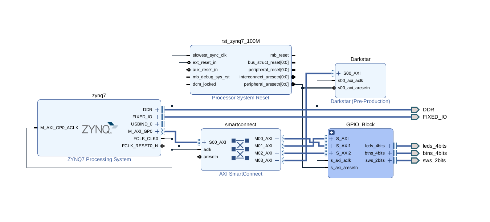

# Introduction

This README will serve as a journal for my work on my RISC-V CPU. For now, I'm attempting to build a basic RISC-V CPU as a side hobby. I used to do some of this on Logisim, but I want to try this on my Arty Zynq board. We'll see where I take this. Why am I calling this *Project Darkstar*? Because it sounds cool.

# Directories

Sources - Contains user source files for Vivado project and is divided into the following sub-directories:

- BIT - Contains bitstream files (.bit)
- COE - Contains memory coefficients files to test sample programs (.coe)
- IMG - Contains image files for the README (.png)
- HDL - Contains HDL source files (.v)
- SIM - Contains testbenches (.v)
- TCL - Contains project TCL scripts to rebuild project (.tcl)
    - To export the project: `write_project_tcl -paths_relative_to ../ -origin_dir_override ../ -target_proj_dir . -force ../Sources/TCL/Project-Recreation-Script.tcl`
- XDC - Contains constraint files (.xdc)

WorkingDir - Working directory of Vivado workspace.

# Part I - Setting Up Project

I'll set up the project with a basic block design. What I want to do is just create a basic pipelined RV32I processor and build from there. Here is the block design:
    - 

In the Darkstar IP, there are 128 AXI registers. I want to have just enough to test everything step by step. To start, I want to set up the register file in the core, where the internal registers reside. I'm following the [released unprivileged spec from May 8, 2025](./riscv-unprivileged-spec-may-8-2025.pdf).

# Part II - Regfile

For this next part, I'll create the regfile, which is a block containing the 32 general purpose registers internal to the CPU core including a register holding the current Program Counter (pc) value. This functionality is relatively simple.

*Testbench has been created and is included in `Sources/IP/Darkstar/sim`*

# Part III - Memory

I want to create 512 bytes and I'll set up this architecture as a Harvard style architecture, separating data and instruction memory into two separate blocks. I want to make this as simple as possible so I'll upgrade it later when I want to.

*Testbench has been created and is included in `Sources/IP/Darkstar/sim`*

# Part IV - ALU

For Part IV, I'm only designing the ALU for the base set, which includes:
- ADD/SUB (Opcode = 000)
    - ADD and SUB are differentiated by a negate signal
- SLL (Opcode = 001)
- SLT (Opcode = 010)
- SLTU (Opcode = 011)
- XOR (Opcode = 100)
- SRL/SRA (Opcode = 101)
    - SRL and SRA are differentiated by a negate signal
- OR (Opcode = 110)
- AND (Opcode = 111)

*Testbench has been created and is included in `Sources/IP/Darkstar/sim`*

# Part V - Control Unit

For Part V, I'm going to behaviorally model the control unit for the different outputs that will control the CPU datapath:
- ALU_Op: The 3-bit ALU opcode
- Negate: Signals the ALU to negate B (used for subtraction or comparing A to B for SLT/SLTU)
- RegWrite: Signals the Register File to write data to a destination register
- B_Src: Selects whether to use rs2 or the immediate value as B for the ALU
- MemSigned: Signals the Data Memory block to sign extend dout or not
- MemWrite: Signals the Data Memory block to store data in memory
- MemRead: Signals the Data Memory block to load data from memory onto dout
- MemSize: Signals the Data Memory block whether the data to load or store is a full word (00), a half word (01), or a byte (10). MemSize = 11 is an invalid code.
- BEQ: Instruction is a BEQ instruction
- BNE: Instruction is a BNE instruction
- BLT: Instruction is a BLT instruction
- BGE: Instruction is a BGE instruction
- BLTU: Instruction is a BLTU instruction
- BGEU: Instruction is a BGEU instruction
- LUI: Instruction is a LUI instruction
- AUIPC: Instruction is a AUIPC instruction
- JAL: Instruction is a JAL instruction
- JALR: Instruction is a JALR instruction
- Valid: Instruction is valid

# Special Thanks

I'm dedicating this section to the wonderful people at the [Digital Design HQ discord](https://discord.gg/4YWKUryprY) who have helped me build this project.
- [Mahir Abbas](https://github.com/MahirAbbas)
- [Andrew Clark (FL4SHK)](https://github.com/fl4shk)
- [sarvel](https://sarvel.xyz/)
- [saahm](https://github.com/saahm)
