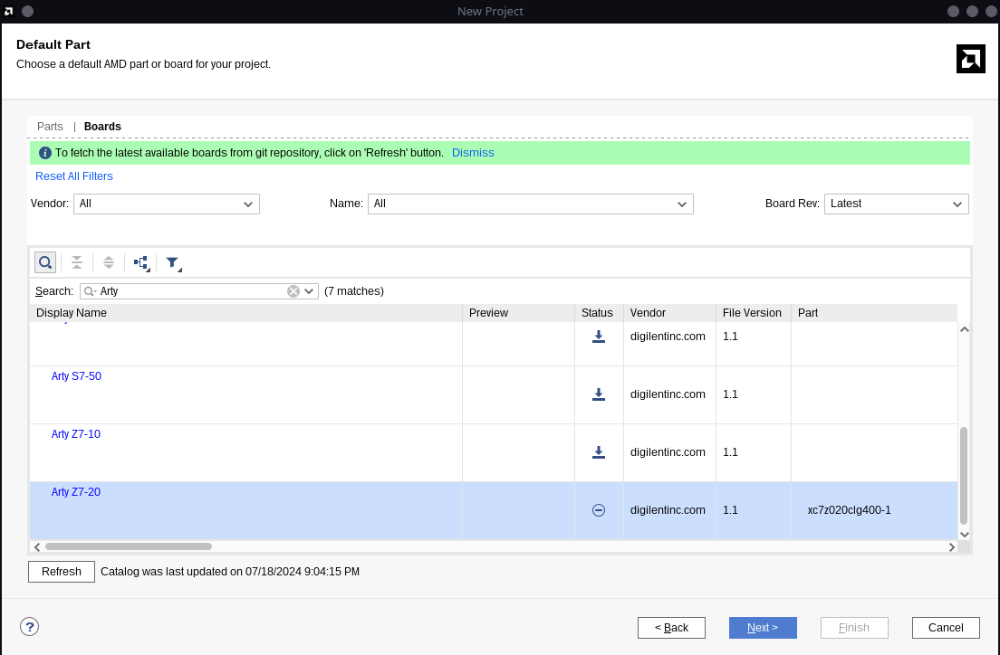
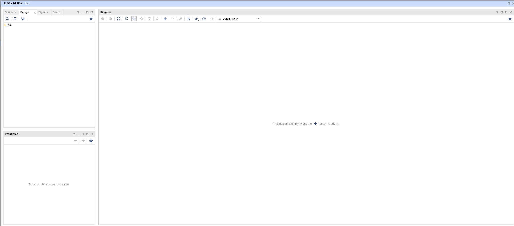
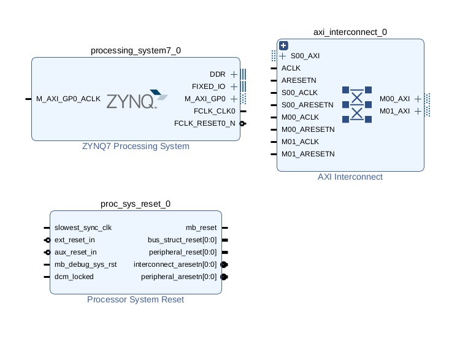
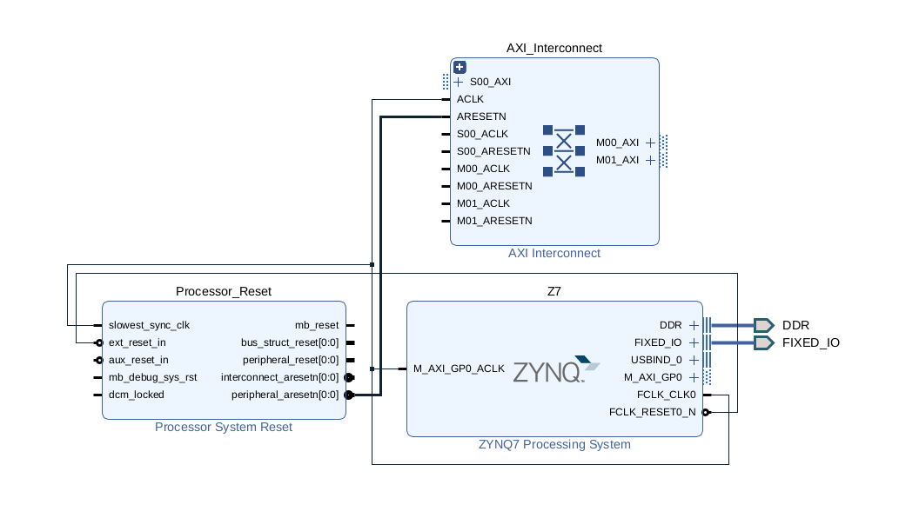
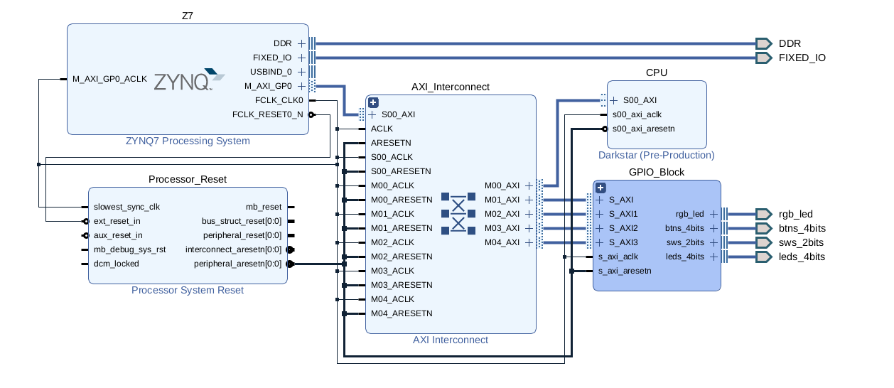
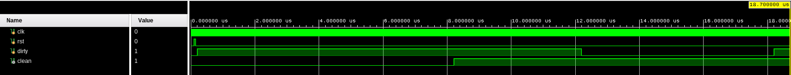

## Introduction

This README will be an in-depth breakdown of my RISC-V soft processor design in Vivado. 

I like to document every little step 

## Table of Contents

[Fill in later]

### <ins>Directories</ins>

Sources - Contains user source files for Vivado project and is divided into the following sub-directories:

- BIT - Contains bitstream files (.bit)
- HDL - Contains HDL source files (.v)
- IMG - Contains images for README
- SIM - Contains testbenches (.v)
- TCL - Contains project TCL scripts to rebuild project (.tcl)
    - To export the project: `write_project_tcl -paths_relative_to ../ -origin_dir_override ../ -target_proj_dir . -force ../Sources/TCL/Project-Recreation-Script.tcl`
- XDC - Contains constraint files (.xdc)

WorkingDir - Working directory of Vivado workspace.

## Part I: Setting Up Project

I'm using an [Arty Z7-20 FPGA](https://digilent.com/reference/programmable-logic/arty-z7/start) to test my design.

At this point, I have an empty block design:

### <ins>My Design Plans</ins>

My plan is to practice Yocto and practice CPU design at the same time. So, what I'll do is create my soft CPU core as AXI IP. This way, I can get a way to interface with my CPU by giving it instructions and to read statuses to make sure it's functioning properly. **Yes, I'm using the ARM cores to control and debug a RISC-V core lol.**

## Part II: Top Block Design

To start, I add the `ZYNQ7 Processing System`, `AXI Interconnect`, and `Processor System Reset`:

After running Block Automation and Connection Automation, this is what my block design looks like:

## Part III: Creating My RISC-V IP

I want a lot of registers so I created 128 AXI slave registers for debugging and core implementation of the CPU. I also created an `AXI GPIO` block to interface with the Z7's LEDs, Buttons, and Switches.

After that, I attached a constraints file and created a block wrapper as the top file.

## Part IV: Debouncing Input Signals

Right now, I have 4 buttons as input, 4 LEDs as output, 2 RGB LEDs as output, and 2 switches as input. 

I don't know of a particular use case for them yet, but they might come in handy for debugging purposes.

For inputs (buttons and switches), I need to debounce the signals. I'm making a custom HDL module to debounce the signals.

## Part V: Modifying IP

Apparently, in Vivado 2024.1, there is a [bug where the AXI code generator creates faulty code](https://adaptivesupport.amd.com/s/article/000037171?language=en_US). I could try to fix this myself by manually adding in the code, but I'm just going to upgrade to 2024.2.

## Special Thanks

I'm dedicating this section to the wonderful people at the [Digital Design HQ discord](https://discord.gg/4YWKUryprY) who have helped me build this project.
- [Mahir Abbas](https://github.com/MahirAbbas)
- [Andrew Clark (FL4SHK)](https://github.com/fl4shk)
- [sarvel](https://sarvel.xyz/)
- [saahm](https://github.com/saahm)
